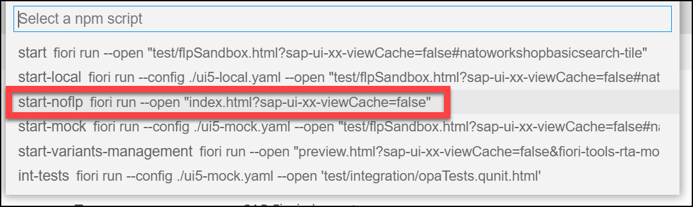

# Add Search and Filters to List Report

## Task 1: Duplicate CDS **ZWS##_CDS_LIST** to **ZWS##_CDS_LIST_SEARCH**

</br>Make sure you change the *@AbapCatalog.sqlViewName*.</br>
Add extra field for CreationDate and Customer Email.

```ABAP CDS
@AbapCatalog.sqlViewName: 'ZWK##CDSLISTSRCH'
@AbapCatalog.compiler.compareFilter: true
@AbapCatalog.preserveKey: true
@AccessControl.authorizationCheck: #CHECK
@EndUserText.label: 'List Report'
@UI.headerInfo.typeName: 'Sales Order'
@UI.headerInfo.typeNamePlural: 'Sales Orders'
define view ZWS##_CDS_LIST_SEARCH 
  as select from ztmcds9_i_so
{
      @UI.lineItem: [{position: 10 }]
  key Id                                                                   as SalesOrderID,
      CustomerId                                                           as CustomerID,
      @UI.lineItem: [{position: 20 },{ label: 'Customer Name' }]
      _Customer.name                                                       as CustomerName,
      @UI.lineItem: [{position: 30 },{ label: 'E-mail' }]
      _Customer.email                                                      as CustomerEmail,
      @UI.lineItem: [{position: 40 }]
      GrossAmount,
      @UI.lineItem: [{position: 50},{ label: 'Creation Date' }]
      cast( left(cast(CreationDateTime as abap.char( 30)),8) as abap.dats) as CreationDate
}
```

## Task 2: Add the new CDS to your *Service Definition*

```ABAP
@EndUserText.label: 'UI ## Service Definition'
define service ZUI_WKSP_## {
  expose ZWS##_CDS_Simple as SimpleCDS;
  expose ZWS##_CDS_Basic as BasicCDS;
  expose ZWS##_CDS_LIST as BasicList;
  expose ZWS##_CDS_LIST_SEARCH as BasicSearch;
}
```

## Task 3: Create a new Fiori elements application with the new CDS

Create a new Fiori Application using the Template Wizard for a *List Report*
| Field | Value |
|-|-|
| Data source | Connect to a System |
| System | abap-cloud-default_xx-dev (BTP) |
| Service | ZUI_WKSP_## |
| Main entity | BasicSearch |
| Module name | basic-search |
| Application title | Basic List with Search |
| Application namespace | nato.workshop |
| Description | Basic List with Search |
| Project folder path | /home/user/projects |
| Add deployment configuration | Yes |
| Add FLP configuration | Yes |
| Deployment Target | Cloud Foundry |
| Destination name | abap-cloud-default_xx(SCP)  |
| Add application to managed application router | Yes |
| Semantic Object | NATO |
| Action | BasicSearch |
| Title | Basic List with Search |
| Subtitle | Workshop |

* Data Source and Service Selection</br>
* Entity Selection</br>
* Project Attributes</br>
* Deployment Configuration</br>
* Fiori Launchpad Configuration</br>
* Preview Application</br>
* Select start-noflp, this is the fastest test.</br>
* Result</br>

## Task 4: Add Search to CDS view

* Add a *@Search.searchable: true* annotation to your CDS view before the `define view...`.
* Set fields *CustomerName* and *CustomerEmail* as default search elements.
* Set Fuzzy search level at 60%.
* Activate your CDS and Reload your fiori application to see the results.

```ABAP CDS
@AbapCatalog.sqlViewName: 'ZWK##CDSLISTSRCH'
@AbapCatalog.compiler.compareFilter: true
@AbapCatalog.preserveKey: true
@AccessControl.authorizationCheck: #CHECK
@EndUserText.label: 'List Report'
@UI.headerInfo.typeName: 'Sales Order'
@UI.headerInfo.typeNamePlural: 'Sales Orders'
@Search.searchable: true
define view ZWS##_CDS_LIST_SEARCH
  as select from ztmcds9_i_so
{
      @UI.lineItem: [{position: 10 }]
  key Id                                                                   as SalesOrderID,
      CustomerId                                                           as CustomerID,
      @UI.lineItem: [{position: 20 },{ label: 'Customer Name' }]
      @Search.defaultSearchElement: true
      _Customer.name                                                       as CustomerName,
      @UI.lineItem: [{position: 30 },{ label: 'E-mail' }]
      @Search.defaultSearchElement: true
      @Search.fuzzinessThreshold : 0.6
      _Customer.email                                                      as CustomerEmail,
      @UI.lineItem: [{position: 40 }]
      GrossAmount,
      @UI.lineItem: [{position: 50},{ label: 'Creation Date' }]
      cast( left(cast(CreationDateTime as abap.char( 30)),8) as abap.dats) as CreationDate
}
```

* Result
* Play a bit with the fuzzy search levels.

## Task 4: Add Selection fields for Filtering

* Add filters for fields *CustomerId* and *CreationDate*.

```ABAP CDS
@AbapCatalog.sqlViewName: 'ZWK##CDSLISTSRCH'
@AbapCatalog.compiler.compareFilter: true
@AbapCatalog.preserveKey: true
@AccessControl.authorizationCheck: #CHECK
@EndUserText.label: 'List Report'
@UI.headerInfo.typeName: 'Sales Order'
@UI.headerInfo.typeNamePlural: 'Sales Orders'
@Search.searchable: true
define view ZWS##_CDS_LIST_SEARCH
  as select from ztmcds9_i_so
{
      @UI.lineItem: [{position: 10 }]
  key Id                                                                   as SalesOrderID,
      @UI.selectionField: [{position: 10}]
      CustomerId                                                           as CustomerID,
      @UI.lineItem: [{position: 20 },{ label: 'Customer Name' }]
      @Search.defaultSearchElement: true
      @Search.fuzzinessThreshold : 0.6
      _Customer.name                                                       as CustomerName,
      @UI.lineItem: [{position: 30 },{ label: 'E-mail' }]
      @Search.defaultSearchElement: true
      _Customer.email                                                      as CustomerEmail,
      @UI.lineItem: [{position: 40 }]
      GrossAmount,
      @UI.lineItem: [{position: 50},{ label: 'Creation Date' }]
      @UI.selectionField: [{position: 20}]
      cast( left(cast(CreationDateTime as abap.char( 30)),8) as abap.dats) as CreationDate
}

```

* Result
* With active filter
* Basic Filter Screen

## Task 5: Add Value Helps to Filters

* Have a look at CDS **ZTMCDS9_C_VH_CUST** in package **Z_TMC**.
* Use this CDS as Value Help for the *CustomerId*.
* Add *@Consumption.filter.selectionType: #INTERVAL* to the *CreationDate* filter and see the result.

```ABAP CDS
@AbapCatalog.sqlViewName: 'ZWK##CDSLISTSRCH'
@AbapCatalog.compiler.compareFilter: true
@AbapCatalog.preserveKey: true
@AccessControl.authorizationCheck: #CHECK
@EndUserText.label: 'List Report'
@UI.headerInfo.typeName: 'Sales Order'
@UI.headerInfo.typeNamePlural: 'Sales Orders'
@Search.searchable: true
define view ZWS##_CDS_LIST_SEARCH
  as select from ztmcds9_i_so
  association [1] to ztmcds9_c_vh_cust as _CustomerVH
    on $projection.CustomerID = _CustomerVH.SoldToParty
{
      @UI.lineItem: [{position: 10 }]
  key Id                                                                   as SalesOrderID,
      @UI.selectionField: [{position: 10}]
      @Consumption.valueHelpDefinition: [{ entity:{ name: 'ZTMCDS9_C_VH_CUST', element: 'SoldToParty' }}]
      CustomerId                                                           as CustomerID,
      @UI.lineItem: [{position: 20 },{ label: 'Customer Name' }]
      @Search.defaultSearchElement: true
      @Search.fuzzinessThreshold : 0.6
      _Customer.name                                                       as CustomerName,
      @UI.lineItem: [{position: 30 },{ label: 'E-mail' }]
      @Search.defaultSearchElement: true
      _Customer.email                                                      as CustomerEmail,
      @UI.lineItem: [{position: 40 }]
      GrossAmount,
      @UI.lineItem: [{position: 50},{ label: 'Creation Date' }]
      @UI.selectionField: [{position: 20}]
      @Consumption.filter.selectionType: #INTERVAL
      cast( left(cast(CreationDateTime as abap.char( 30)),8) as abap.dats) as CreationDate,
      _CustomerVH
}
```

* Filter for *CustomerId*
* Filter for *CreationDate*
