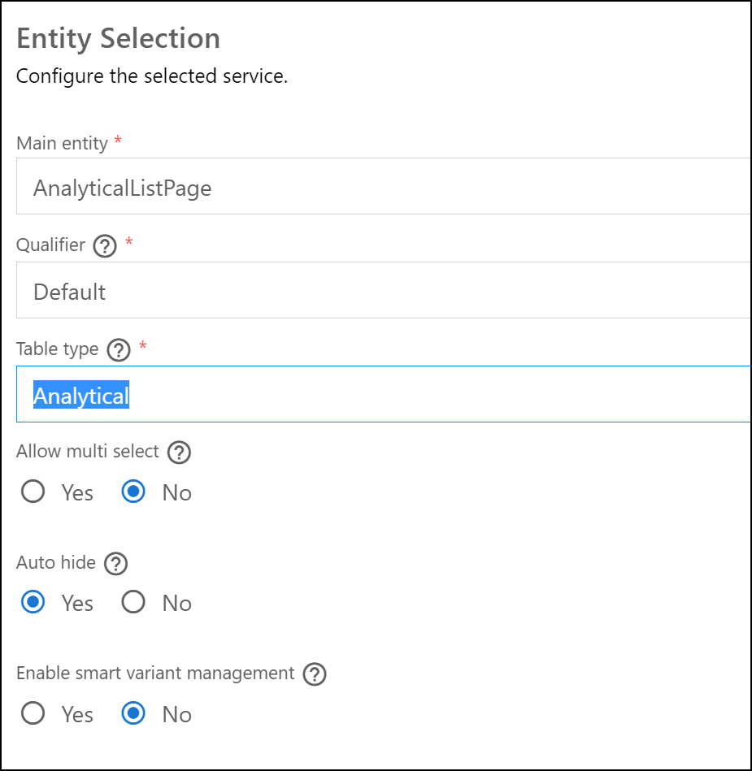
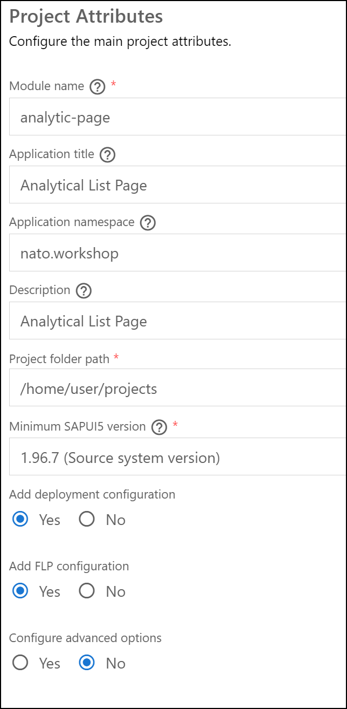
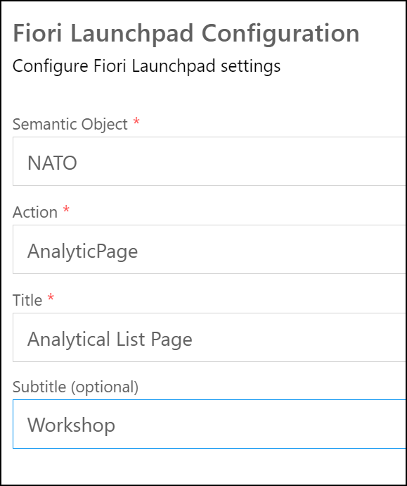
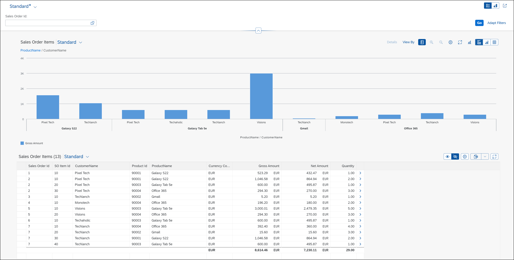

# Analytical List Page

## Task 1: Create a new CDS view **ZWS##_CDS_ALP**

* Create a new CDS base on CDS **ztmcds9_c_items_cube**
* Set the annotatin *@Metadata.allowExtensions: true*
* Add the following fields

|Field|Annotation|
|-|-|
|SoId|
|Id|
|CustomerName| @AnalyticsDetails.query.display: #TEXT_KEY |
|ProductId|
|ProductName|
|CurrencyCode|
|GrossAmount| @Aggregation.default: #SUM |
|NetAmount| @Aggregation.default: #SUM |
|Quantity| @Aggregation.default: #SUM |

```ABAP CDS
@AbapCatalog.sqlViewName: 'ZWS##CDSALP'
@AbapCatalog.compiler.compareFilter: true
@AbapCatalog.preserveKey: true
@AccessControl.authorizationCheck: #CHECK
@EndUserText.label: 'Analytical List Page'
@Metadata.allowExtensions: true
define view ZWS##_CDS_ALP as select from ztmcds9_c_so_items_cube {
    key SoId,
    key Id,
    @AnalyticsDetails.query.display: #TEXT_KEY
    CustomerName,
    ProductId,
    ProductName,
    CurrencyCode,
    @Aggregation.default: #SUM
    GrossAmount,
    @Aggregation.default: #SUM
    NetAmount,
    @Aggregation.default: #SUM
    Quantity
}
```

## Task 2: Create new Metadata Extension **ZWS##_ME_CDS_ALP**

* Add annotation *@UI.lineitem: [{position}]* to all fields
* Make field *SoId* a filter selection field
* Add *@UI.headerInfo* to your CDS
* Add *@UI.selectionPresentationVariant, @UI.presntationVariant, @UI.chart and @UI.selectionVariant* to your CDS

```ABAP CDS
@Metadata.layer: #CUSTOMER

@UI.headerInfo: { typeName: 'Sales Order Item',
                  typeNamePlural: 'Sales Order Items',
                  title.value: 'CustomerName',
                  description.value: 'ProductName'
                }

@UI.selectionPresentationVariant: [
    {
        qualifier: 'Default',
        presentationVariantQualifier: 'Default',
        selectionVariantQualifier: 'Default'
    }
]
@UI.presentationVariant: [
    {
        qualifier: 'Default',
        visualizations: [{
            type: #AS_CHART,
            qualifier: 'ChartDefault'
        }]
    }
]
@UI.chart: [
    {
        qualifier: 'ChartDefault',
        title: 'Sales by Customer',
        chartType: #COLUMN,
        dimensions: [ 'CustomerName', 'ProductName' ],
        measures: [ 'GrossAmount' ],
        dimensionAttributes: [
            {
                dimension: 'CustomerName',
                role: #CATEGORY
            },
            {
                dimension: 'ProductName',
                role: #CATEGORY
            }
        ],
        measureAttributes: [{
            measure: 'GrossAmount',
            role: #AXIS_1,
            asDataPoint: false
        }] 
    }
]
@UI.selectionVariant: [
    {
        qualifier: 'Default',
        text: 'Default'
    }
]

annotate view ZWS##_CDS_ALP
    with 
{
    @UI.lineItem : [{ position: 10}]
    @UI.selectionField: [{ position: 10 }]
    SoId;
    @UI.lineItem : [{ position: 20}]
    Id;
    @UI.lineItem : [{ position: 30}]
    CustomerName;
    @UI.lineItem : [{ position: 40}]
    ProductId;
    @UI.lineItem : [{ position: 50}]
    ProductName;
    @UI.lineItem : [{ position: 60}]
    CurrencyCode;
    @UI.lineItem : [{ position: 70}]
    GrossAmount;
    @UI.lineItem : [{ position: 80}]
    NetAmount;
    @UI.lineItem : [{ position: 90}]
    Quantity;    
}
```

## Task 3: Add the new CDS to your *Service Definition*

* Add your CDS as **AnalyticalListPage** to your *Service Definition*

```ABAP
@EndUserText.label: 'UI ## Service Definition'
define service ZUI_WKSP_## {
  expose ZWS##_CDS_Simple as SimpleCDS;
  expose ZWS##_CDS_Basic as BasicCDS;
  expose ZWS##_CDS_LIST as BasicList;
  expose ZWS##_CDS_LIST_SEARCH as BasicSearch;
  expose ZWS##_CDS_LIST_OBJECT as ListObject;
  expose ZWS##_CDS_C_LO as ListObjectME;
  expose ZWS##_CDS_NAV_EXT as ExtNavi;
  expose ZWS##_CDS_OVP as OverviewPage;
  expose ZWS##_CDS_ALP as AnalyticalListPage;
}
```

## Task 4: Create a new Fiori elements application with the CDS/OData V2

Create a new Fiori Application using the Template Wizard for a *Analytical List Pagee*
| Field | Value |
|-|-|
| Data source | Connect to a System |
| System | abap-cloud-default_xx-dev (BTP) |
| Service | ZUI_WKSP_##_V2 |
| Main entity | AnalyticalListPage |
| Qualifier | Default |
| Table type | Analytical |
| Allow multi select | No |
| Auto hide | Yes |
| enable smart variant management | No |
| Module name | analytic-page |
| Application title | Analytical List Page |
| Application namespace | nato.workshop |
| Description | Analytical List Page |
| Project folder path | /home/user/projects |
| Add deployment configuration | Yes |
| Add FLP configuration | Yes |
| Deployment Target | Cloud Foundry |
| Destination name | abap-cloud-default_xx(SCP)  |
| Add application to managed application router | Yes |
| Semantic Object | NATO |
| Action | AnalyticPage |
| Title | Analytical List Page |
| Subtitle | Workshop |

* Data Source and Service Selection</br>
* Entity Selection</br>
* Project Attributes</br>
* Fiori Launchpad Configuration</br>
* Preview the Application

[Back to Exercises](../README.md)
