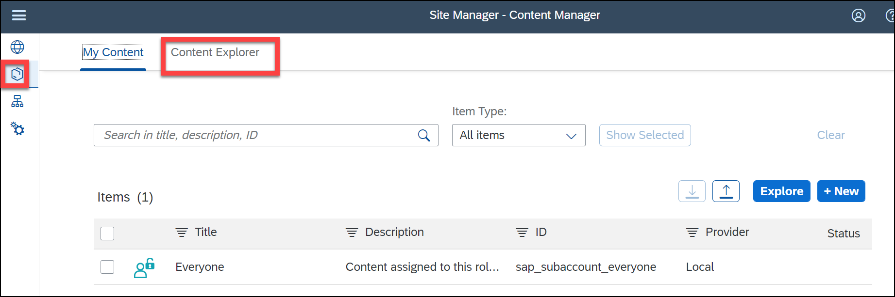

# Build & Deploy Application and Configure Fiori Cloud Launchpad

## Build and Deploy

* Right click on the **mta.yaml** file and select *Build MTA Project*

 
This will start a terminal and it will create 3 new directories: *dist*, *mta_archives* and *resources*.

* Open the *mta_archives* folder and right click the **.mtar** file and select *Deploy MTA Archive*
* Check your Cloud Foundry Endpoint and press *Enter* to confirm. 
* Enter your e-mail address and password of your trial account.
* Select your Organisation and Space

This will open another terminal that will deploy the **.mtar** to the cloud. This can take a moment.

* To see if all went well you can goto your SAP BTP Trial Cockpit and the option **HTML5 Applications** on the left side. 
* If you filter on *natoworkshop* you should see your application. 
* Click on the application and your application will start. 

## Configure Fiori Launchpad Cloud

* Goto *Instances and Subscriptions* in your BTP Cockpit and goto the Launchpad Service  
* In the Site Directory select the **provider manager** 
* Refresh the HTML5 Apps 
* Goto the **Content Manager** and click the tab *Content Explorer* 
* Click the **HTML5 Apps** 
* User filter **nato** to list your **Basic List** application and add it to My Content 
* Goto the tab *My Content*, here you see your **Basic List** application. Now lets create a Role. 
* Enter the *Title*, *ID* and *Description*, then click on the search block under Assign Items:, you now see a your application. Press the <kbd>+</kbd> button behind your application, then *Save* and then *Back* 
* We now have a new Role Now lets create a Group. 
* Enter the *Title* and *Description*, then click on the search block under Assign Items:, you now see a your application. Press the <kbd>+</kbd> button behind your application, then *Save* and then *Back* 
* We now have a new Group Now lets create a Catalog 
* Enter the *Title* and *Description*, then click on the search block under Assign Items:, you now see a your application. Press the <kbd>+</kbd> button behind your application, then *Save* and then *Back*! 
* We now have a new Catalog 
* Next we assign the created Role to our Site 
* We *Edit* the Site 
* Click on the search block under Assign Items:, you now see a your Role. Press the <kbd>+</kbd> button behind your role, then *Save* and then *Back* 
* Goto the Site/Launchpad 
* Our Launchpad is still empty. This is because we have not yet assigned the new Role to our user.
* Goto your BTP Cockpit and select *Role Collections*, Filter on **workshop** and click on your Role 
* Goto *Edit* mode and enter your e-mail address of your trial account in the fields **ID** and **E-Mail** and press *Save* 
* Now lets start our Launchpad again.  

> Hint: it is sometimes needed to start a browser in *Private/Incognito mode* and lauch the Fiori Launchpad again, to make your changes available.

[Back to Exercises](../README.md)
