# Create Basic List Report

Copy your *ZWS##_CDS_SIMPLE* to **ZWS##_CDS_LIST**.</br>
Remember to change the @AbapCatalog.sqlViewName and @EndUserText.label values.</br>

```ABAP CDS
@AbapCatalog.sqlViewName: 'ZWK##CDSLIST'
@AbapCatalog.compiler.compareFilter: true
@AbapCatalog.preserveKey: true
@AccessControl.authorizationCheck: #CHECK
@EndUserText.label: 'List Report'
@UI.headerInfo.typeName: 'Sales Order'
@UI.headerInfo.typeNamePlural: 'Sales Orders'
define view ZWS##_CDS_LIST as select from ztmcds9_i_so {
@UI.lineItem: [{position: 10 }]
    key Id as SalesOrderID,
    CustomerId as CustomerID,
@UI.lineItem: [{position: 20 },{ label: 'Customer Name' }]    
    _Customer.name as CustomerName,
@UI.lineItem: [{position: 30 }]    
    GrossAmount
}
```

Activate the CDS and add it to the Service Binding as **BasicList**

```ABAP CDS
@EndUserText.label: 'UI 98 Service Definition'
define service ZUI_WKSP_98 {
  expose ZWS##_CDS_Simple as SimpleCDS;
  expose ZWS##_CDS_Basic as BasicCDS;
  expose ZWS##_CDS_LIST as BasicList;
}
```

Start your SAP Business Application Studio.</br>
Open/Create your Dev Space.

There are two options to start the Fiori Template Wizard.</br>

1. From the Welcome page you select *Start from template* and then select the **SAP Fiori application**
2. From the menu select *View* then *Find Command... (<kbd>Ctrl</kdb>+<kbd>shift</kbd>+<kbd>P</kbd>)* and then type **Fiori: Open Application Generator**

* Select the Application Type: **SAP Fiori elements**, and select the **List Report Object Page** and press <kbd>Next</kbd>.</br>
In the Data source select *Connect to a System*, in the System select *your abap-cloud-default..(BTP)*. It will now look for the OData services on the Trial ABAP Cloud system, this may take a minute.</br>
In the Service select your Service Binding ZUI_WKSP_##.
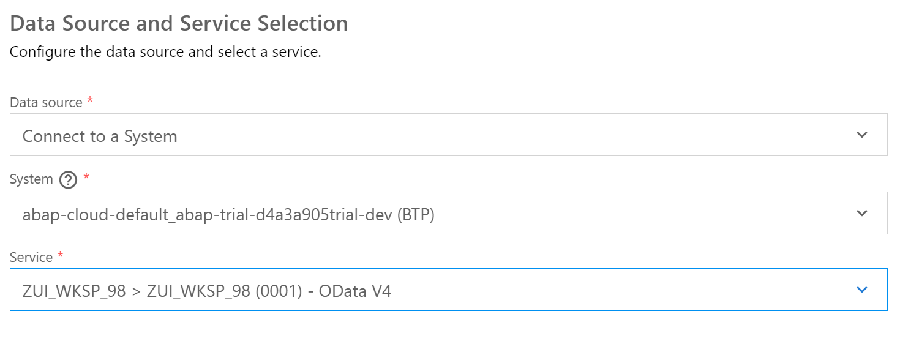</br>
* Press <kbd>Next</kbd></br>
* Select your **BasicList** as the *Main entity*.
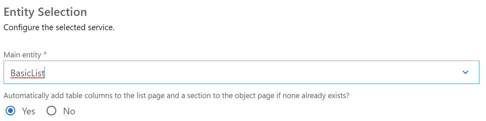</br>
* Press <kbd>Next</kbd></br>
Enter the Projects Attributes

| Name | Value |
| ------------ | ------------- |
| Module name | basic-list |
| Application title | Basic List |
| Application namespace | nato.workshop |
| Description | Basic List |
| Project folder path | /home/user/projects |
| Minimum SAPUI5 version| leave as is |
| Add deployment configuration | Yes |
| Add FLP configuration | Yes |
| Configure advanced options| No |

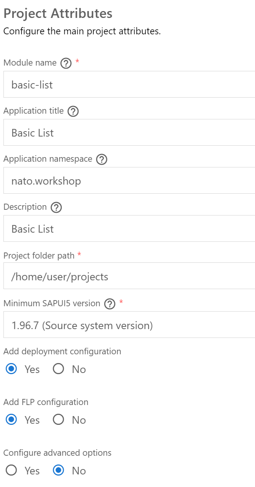</br>

* Press <kbd>Next</kbd></br>
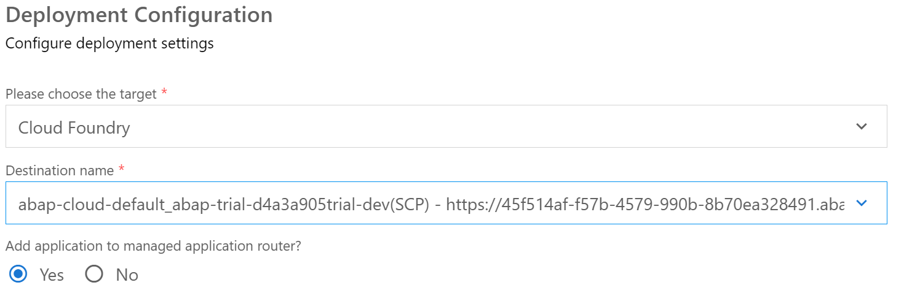</br>

* Press <kbd>Next</kbd></br>

Enter Fiori Launchpad settings

| Name | Value |
| ------------ | ------------- |
| Semantic Object | NATO |
| Action | BasicList |
| Title | Basic List |
| Subtitle (optional) | Workshop |

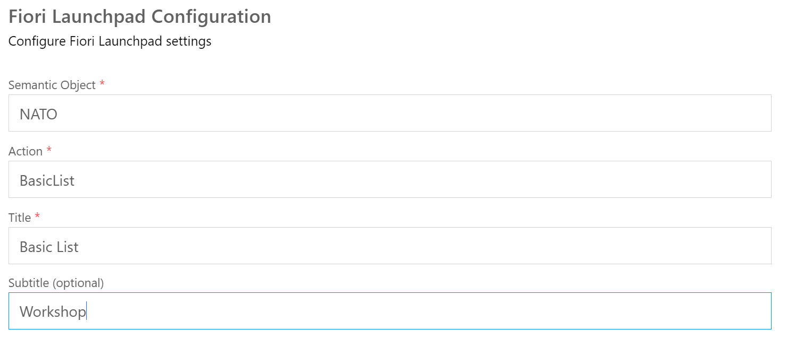</br>

* Press <kbd>Finish</kbd></br>
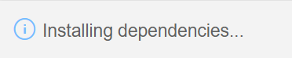</br>

* The installation of the dependencies may take a few moments.</br>
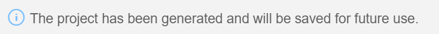</br>

* When is is done you will see a page with Application Information.
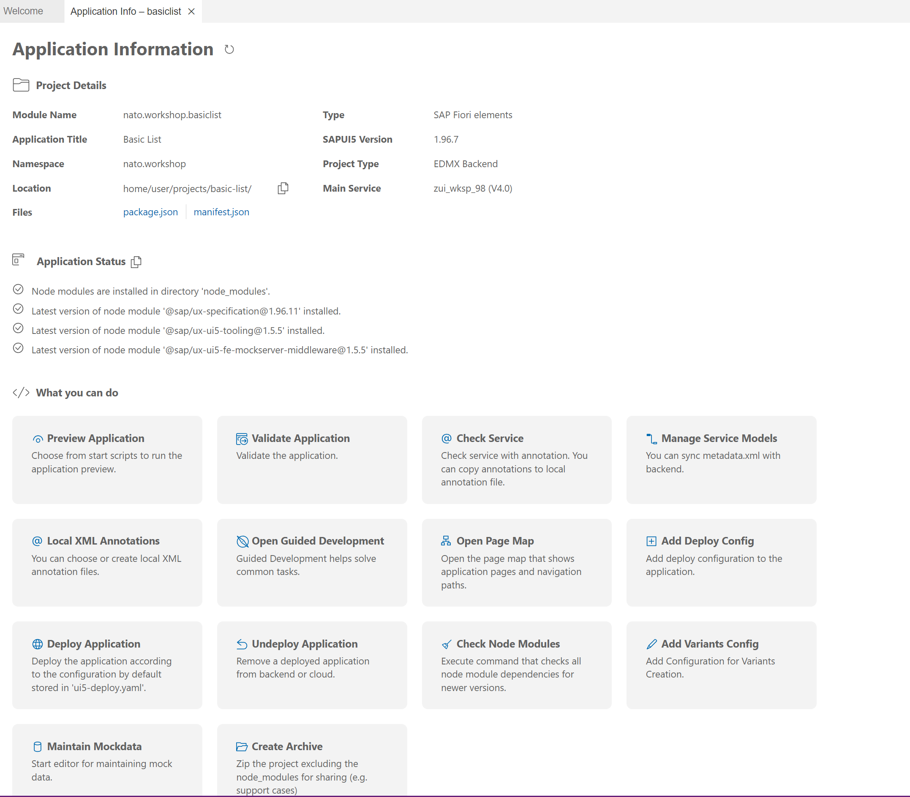</br>

* Press *Preview Application* to start the application.

## Open the project folder and activate GIT

* Open the projects folder.</br>
* Click on the *GIT* tab. 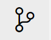 and press the + Plus button.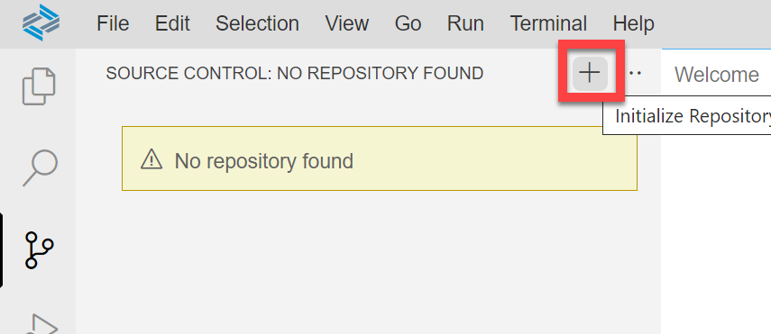</br>
* This will instantiate the GIT source control. Enter a message, e.g.: **Initial** and press **CTRL+Enter**.</br>
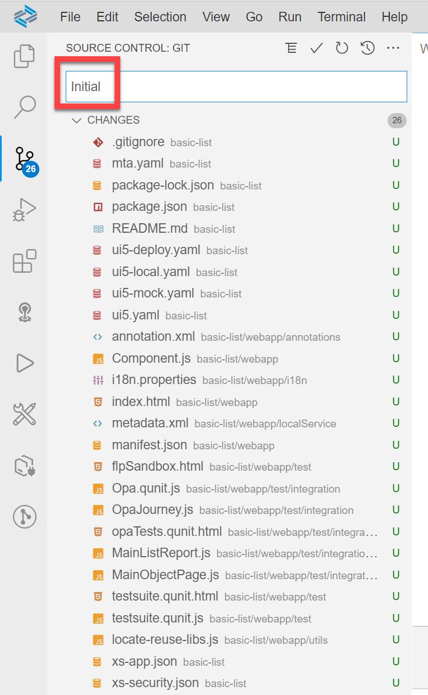</br>
Select *Always* in the popup.</br>
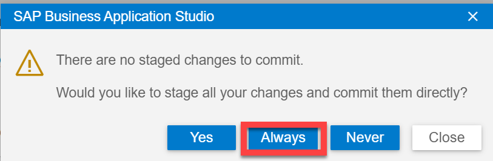</br>
