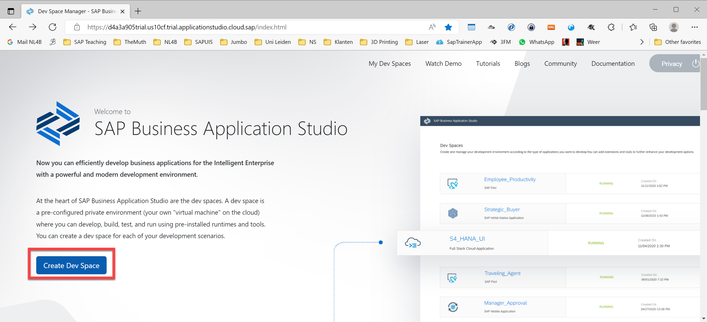
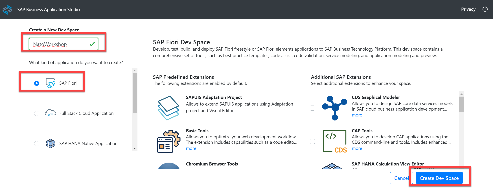
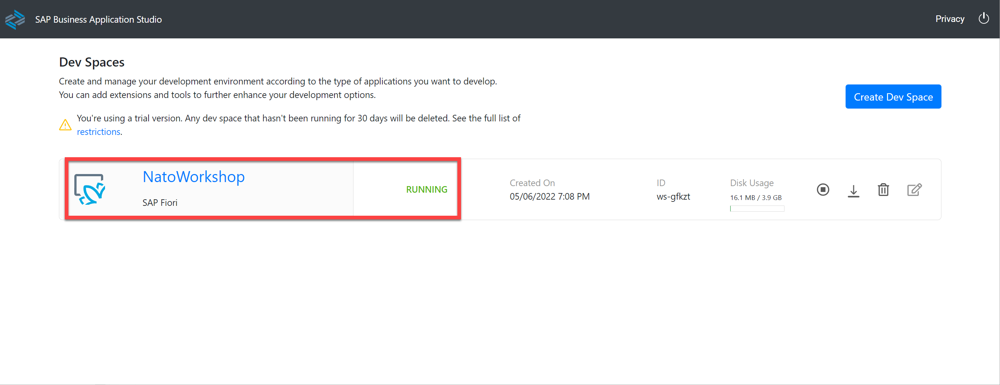
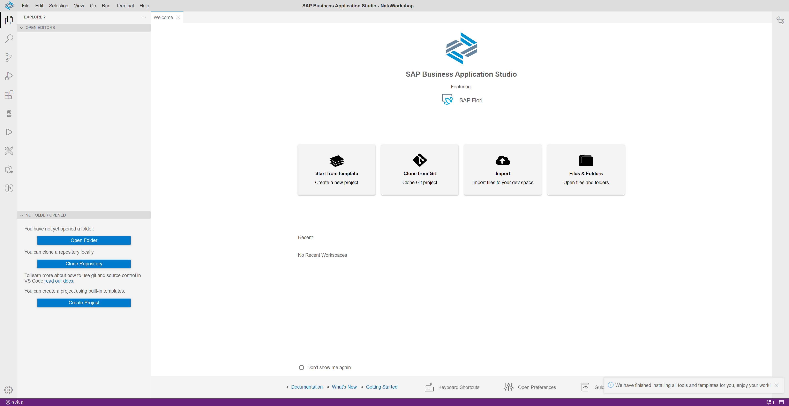

# Create Dev Space in SAP Business Application Studio for Workshop
Start your SAP Business Application Studio. 
Press the Create Dev Space button.
 
Enter the name for your Dev Space, e.g.: **NatoWorkshop**, select **SAP Fiori** and pres the Create Dev Space button.
 
This will create and start the Dev Space.
 
When the Dev Space is running you can click on the name and the Business Application Studio is opened.
 
 
