# Create List Report Object Page

## Task 1: Duplicate CDS **ZWS##_CDS_LIST_SEARCH** to **ZWS##_CDS_LIST_OBJECT**

## Task 2: Add the new CDS to your *Service Definition*

```ABAP
@EndUserText.label: 'UI ## Service Definition'
define service ZUI_WKSP_## {
  expose ZWS##_CDS_Simple as SimpleCDS;
  expose ZWS##_CDS_Basic as BasicCDS;
  expose ZWS##_CDS_LIST as BasicList;
  expose ZWS##_CDS_LIST_SEARCH as BasicSearch;
  expose ZWS##_CDS_LIST_OBJECT as ListObject;
}
```

## Task 3: Create a new Fiori elements application with the new CDS

Create a new Fiori Application using the Template Wizard for a *List Report*
| Field | Value |
|-|-|
| Data source | Connect to a System |
| System | abap-cloud-default_xx-dev (BTP) |
| Service | ZUI_WKSP_## |
| Main entity | ListObject |
| Module name | basic-object |
| Application title | Basic Object |
| Application namespace | nato.workshop |
| Description | Basic Object |
| Project folder path | /home/user/projects |
| Add deployment configuration | Yes |
| Add FLP configuration | Yes |
| Deployment Target | Cloud Foundry |
| Destination name | abap-cloud-default_xx(SCP)  |
| Add application to managed application router | Yes |
| Semantic Object | NATO |
| Action | BasicObject |
| Title | Basic List Object |
| Subtitle | Workshop |

* Data Source and Service Selection</br>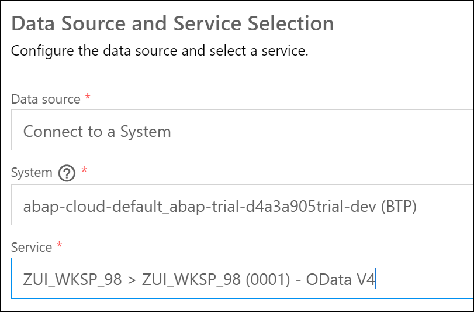
* Entity Selection</br>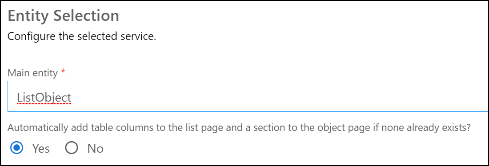
* Project Attributes</br>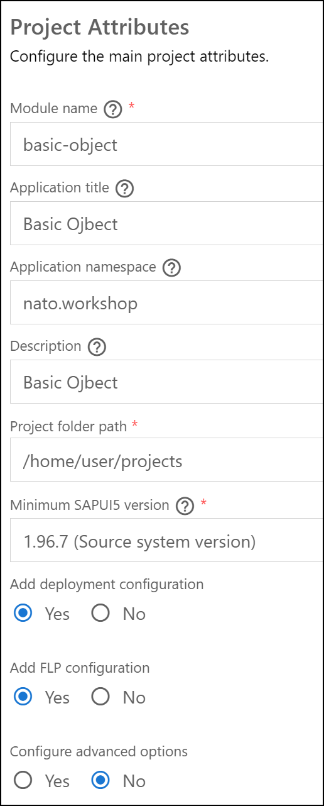
* Deployment Configuration</br>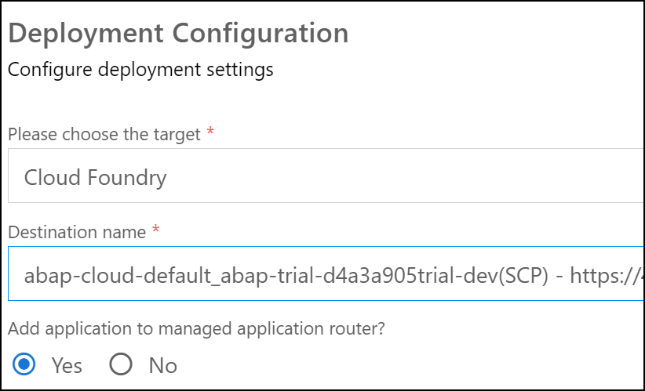
* Fiori Launchpad Configuration</br>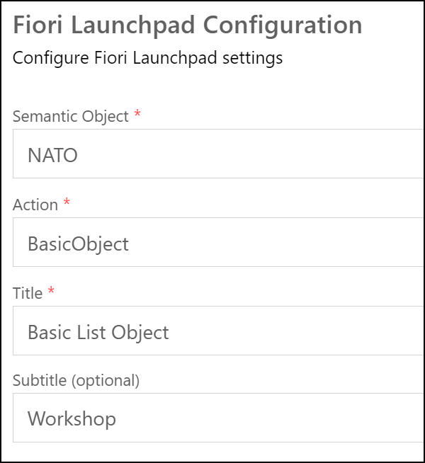
* Preview Application</br>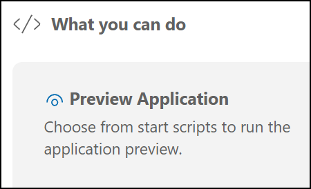
* Select start-noflp, this is the fastest test.</br>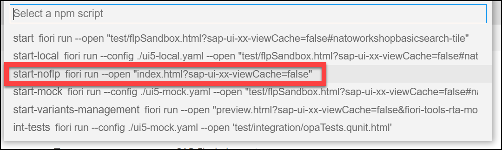
* Result</br>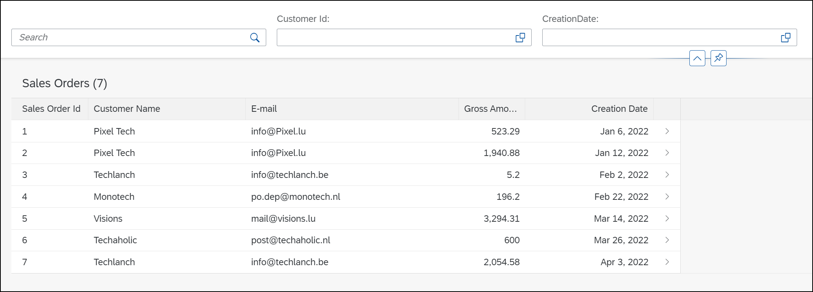
* Select a line</br>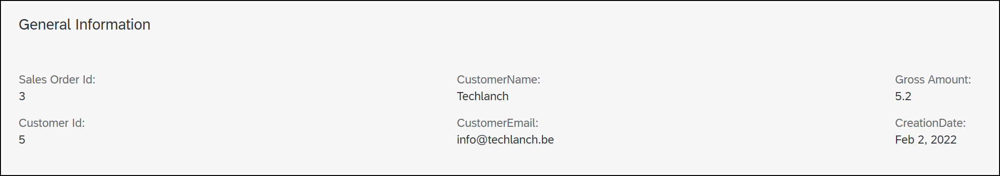

## Task 4: Basic Object Page

* Set the title of every single sales order to the value of field **SalesOrderID**.
* Use *@UI.identification* and *@UI.facet* to add more fields to the object page

| Position | Value |
|-|-|
| 10 | SalesOrderID |
| 20 | CustomerID |
| 30 | CustomerName |
| 40 | CustomerEmail |

```ABAP CDS
@AbapCatalog.sqlViewName: 'ZWK##CDSLISTOBJT'
@AbapCatalog.compiler.compareFilter: true
@AbapCatalog.preserveKey: true
@AccessControl.authorizationCheck: #CHECK
@EndUserText.label: 'Object Page'
@UI.headerInfo.typeName: 'Sales Order'
@UI.headerInfo.typeNamePlural: 'Sales Orders'
@UI.headerInfo.title.value: 'SalesOrderID'
@Search.searchable: true
define view ZWS##_CDS_LIST_OBJECT
  as select from ztmcds9_i_so
  association [1] to ztmcds9_c_vh_cust as _CustomerVH on $projection.CustomerID = _CustomerVH.SoldToParty
{

      @UI.facet: [
       {
         id: 'COLLFAC1',
         label: 'General Information',
         type: #COLLECTION,
         position: 10
       },
       {
         label: 'General Information',
         type: #IDENTIFICATION_REFERENCE,
         parentId: 'COLLFAC1',
         position: 10
       }
      ]

      @UI.lineItem: [{position: 10 }]
      @UI.identification: [{position: 10}]
  key Id                                                                   as SalesOrderID,
      @UI.selectionField: [{position: 10}]
      @UI.identification: [{position: 20}]
      @Consumption.valueHelpDefinition: [{ entity:{ name: 'ZTMCDS9_C_VH_CUST', element: 'SoldToParty' }}]
      CustomerId                                                           as CustomerID,
      @UI.lineItem: [{position: 20 },{ label: 'Customer Name' }]
      @UI.identification: [{position: 30}]
      @Search.defaultSearchElement: true
      @Search.fuzzinessThreshold : 0.6
      _Customer.name                                                       as CustomerName,
      @UI.lineItem: [{position: 30 },{ label: 'E-mail' }]
      @UI.identification: [{position: 40}]
      @Search.defaultSearchElement: true
      _Customer.email                                                      as CustomerEmail,
      @UI.lineItem: [{position: 40 }]
      GrossAmount,
      NetAmount,
      TaxAmount,
      DeliveryStatus,
      BillingStatus,
      @UI.lineItem: [{position: 50},{ label: 'Creation Date' }]
      @Consumption.filter.selectionType: #INTERVAL
      cast( left(cast(CreationDateTime as abap.char( 30)),8) as abap.dats) as CreationDate,
      CreationUser,
      @UI.hidden: true
      CurrencyCode,
      _CustomerVH
}
```

* Result 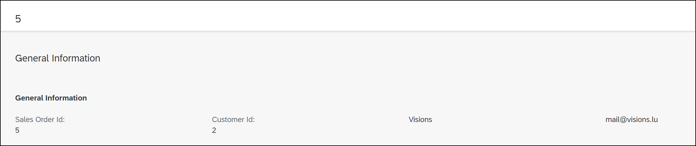

## Task 5: Add Header Facets

* Create two header facets: *AMOUNT* and *STATUS*

| Group | Position | Field |
|-|-|-|
| AMOUNT | 10 | GrossAmount |
| AMOUNT | 20 | NetAmount |
| AMOUNT | 30 | TaxAmound |
| STATUS | 10 | DeliveryStatus |
| STATUS | 20 | BillingStatus |

```ABAP CDS
@AbapCatalog.sqlViewName: 'ZWK##CDSLISTOBJT'
@AbapCatalog.compiler.compareFilter: true
@AbapCatalog.preserveKey: true
@AccessControl.authorizationCheck: #CHECK
@EndUserText.label: 'Object Page'
@UI.headerInfo.typeName: 'Sales Order'
@UI.headerInfo.typeNamePlural: 'Sales Orders'
@UI.headerInfo.title.value: 'SalesOrderID'
@Search.searchable: true
define view ZWS##_CDS_LIST_OBJECT
  as select from ztmcds9_i_so
  association [1] to ztmcds9_c_vh_cust as _CustomerVH on $projection.CustomerID = _CustomerVH.SoldToParty
{

      @UI.facet: [
      {
      id: 'COLLFAC1',
      label: 'General Information',
      type: #COLLECTION,
      position: 10
      },
      {
      label: 'General Information',
      type: #IDENTIFICATION_REFERENCE,
      parentId: 'COLLFAC1',
      position: 10
      },
      {
      label: 'Amount Information',
      purpose: #HEADER,
      type: #FIELDGROUP_REFERENCE,
      targetQualifier: 'AMOUNT',
      position: 10
      },
      {
      label: 'Status Information',
      purpose: #HEADER,
      type: #FIELDGROUP_REFERENCE,
      targetQualifier: 'STATUS',
      position: 10
      }
      ]

      @UI.lineItem: [{position: 10 }]
      @UI.identification: [{position: 10}]
  key Id                                                                   as SalesOrderID,
      @UI.selectionField: [{position: 10}]
      @UI.identification: [{position: 20}]
      @Consumption.valueHelpDefinition: [{ entity:{ name: 'ZTMCDS9_C_VH_CUST', element: 'SoldToParty' }}]
      CustomerId                                                           as CustomerID,
      @UI.lineItem: [{position: 20 },{ label: 'Customer Name' }]
      @UI.identification: [{position: 30}]
      @Search.defaultSearchElement: true
      @Search.fuzzinessThreshold : 0.6
      _Customer.name                                                       as CustomerName,
      @UI.lineItem: [{position: 30 },{ label: 'E-mail' }]
      @UI.identification: [{position: 40}]
      @Search.defaultSearchElement: true
      _Customer.email                                                      as CustomerEmail,
      @UI.lineItem: [{position: 40 }]
      @UI.fieldGroup: [{position: 10, qualifier: 'AMOUNT'}]
      GrossAmount,
      @UI.fieldGroup: [{position: 20, qualifier: 'AMOUNT'}]
      NetAmount,
      @UI.fieldGroup: [{position: 30, qualifier: 'AMOUNT'}]
      TaxAmount,
      @UI.fieldGroup: [{position: 10, qualifier: 'STATUS'}]
      DeliveryStatus,
      @UI.fieldGroup: [{position: 20, qualifier: 'STATUS'}]
      BillingStatus,
      @UI.lineItem: [{position: 50},{ label: 'Creation Date' }]
      @Consumption.filter.selectionType: #INTERVAL
      cast( left(cast(CreationDateTime as abap.char( 30)),8) as abap.dats) as CreationDate,
      CreationUser,
      @UI.hidden: true
      CurrencyCode,
      _CustomerVH
}
```

* Result 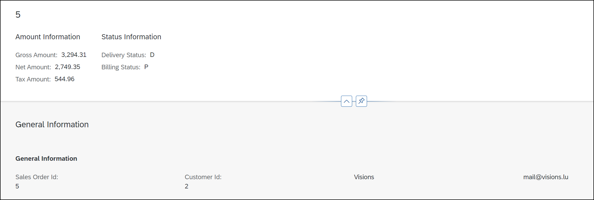

## Task 6: Add Sections

* Create a collection facet for *General information*.
* Create a collection facet for *More information*.
* Assign qualifiers **AMOUNT** and **STATUS** to collection *More information*.

```ABAP CDS
@AbapCatalog.sqlViewName: 'ZWK##CDSLISTOBJT'
@AbapCatalog.compiler.compareFilter: true
@AbapCatalog.preserveKey: true
@AccessControl.authorizationCheck: #CHECK
@EndUserText.label: 'Object Page'
@UI.headerInfo.typeName: 'Sales Order'
@UI.headerInfo.typeNamePlural: 'Sales Orders'
@UI.headerInfo.title.value: 'SalesOrderID'
@Search.searchable: true
define view ZWS##_CDS_LIST_OBJECT
  as select from ztmcds9_i_so
  association [1] to ztmcds9_c_vh_cust as _CustomerVH on $projection.CustomerID = _CustomerVH.SoldToParty
{

  @UI.facet: [
   {
     id: 'COLLFAC1',
     label: 'General Information',
     type: #COLLECTION,
     position: 10 
   },
   {
     id: 'COLLFAC2',
     label: 'More Information',
     type: #COLLECTION,
     position: 20 
   },
   {
     label: 'General Information',
     type: #IDENTIFICATION_REFERENCE,
     parentId: 'COLLFAC1', 
     position: 10
   },
   {
     label: 'Amount Information', 
     parentId: 'COLLFAC2', 
     type: #FIELDGROUP_REFERENCE, 
     targetQualifier: 'AMOUNT', 
     position: 10
   },
   {
     label: 'Status Information', 
     parentId: 'COLLFAC2', 
     type: #FIELDGROUP_REFERENCE, 
     targetQualifier: 'STATUS', 
     position: 20
   }
  ]

      @UI.lineItem: [{position: 10 }]
      @UI.identification: [{position: 10}]
  key Id                                                                   as SalesOrderID,
      @UI.selectionField: [{position: 10}]
      @UI.identification: [{position: 20}]
      @Consumption.valueHelpDefinition: [{ entity:{ name: 'ZTMCDS9_C_VH_CUST', element: 'SoldToParty' }}]
      CustomerId                                                           as CustomerID,
      @UI.lineItem: [{position: 20 },{ label: 'Customer Name' }]
      @UI.identification: [{position: 30}]
      @Search.defaultSearchElement: true
      @Search.fuzzinessThreshold : 0.6
      _Customer.name                                                       as CustomerName,
      @UI.lineItem: [{position: 30 },{ label: 'E-mail' }]
      @Search.defaultSearchElement: true
      _Customer.email                                                      as CustomerEmail,
      @UI.lineItem: [{position: 40 }]
      @UI.identification: [{position: 40}]
      @UI.fieldGroup: [{position: 10, qualifier: 'AMOUNT'}]
      GrossAmount,
      @UI.identification: [{position: 50}]
      @UI.fieldGroup: [{position: 20, qualifier: 'AMOUNT'}]
      NetAmount,
      @UI.identification: [{position: 60}]
      @UI.fieldGroup: [{position: 30, qualifier: 'AMOUNT'}]
      TaxAmount,
      @UI.fieldGroup: [{position: 10, qualifier: 'STATUS'}]
      DeliveryStatus,
      @UI.fieldGroup: [{position: 20, qualifier: 'STATUS'}]
      BillingStatus,
      @UI.lineItem: [{position: 50},{ label: 'Creation Date' }]
      @UI.selectionField: [{position: 20}]
      @Consumption.filter.selectionType: #INTERVAL
      cast( left(cast(CreationDateTime as abap.char( 30)),8) as abap.dats) as CreationDate,
      CreationUser,
      @UI.hidden: true
      CurrencyCode,
      _CustomerVH
}
```

* Result [Result](../../Images/080.png)

## Task 7: Move Annotations to Metadata Extension (Optional)

* Duplicate **ZWS##_CDS_LIST_OBJECT** to **ZWS##_CDS_C_LO**
* Add annotation *@Metadata.allowExtensions: true*
* Create a *Metadata Extenstion* **ZWS##_ME_CDS_C_LO**
* Move all UI annotations to the *Metadata Extenstion*
* Add ZWS##_CDS_C_LO** to your *Service Definition*
* Create a new Fiori Application using the Template Wizard for a *List Report*
  
```ABAP CDS
@AbapCatalog.sqlViewName: 'ZWK98CDSCLISTOBJ'
@AbapCatalog.compiler.compareFilter: true
@AbapCatalog.preserveKey: true
@AccessControl.authorizationCheck: #CHECK
@EndUserText.label: 'Object Page'

@Metadata.allowExtensions: true
define view ZWS98_CDS_C_LO
  as select from ztmcds9_i_so
  association [1] to ztmcds9_c_vh_cust as _CustomerVH on $projection.CustomerID = _CustomerVH.SoldToParty
{

  key Id                                                                   as SalesOrderID,
      CustomerId                                                           as CustomerID,
      _Customer.name                                                       as CustomerName,
      _Customer.email                                                      as CustomerEmail,
      GrossAmount,
      NetAmount,
      TaxAmount,
      DeliveryStatus,
      BillingStatus,
      cast( left(cast(CreationDateTime as abap.char( 30)),8) as abap.dats) as CreationDate,
      CreationUser,
      CurrencyCode,
      _CustomerVH
}
```

---

```ABAP CDS
@Metadata.layer: #CUSTOMER
@UI.headerInfo.typeName: 'Sales Order'
@UI.headerInfo.typeNamePlural: 'Sales Orders'
@UI.headerInfo.title.value: 'SalesOrderID'
@Search.searchable: true
annotate view ZWS98_CDS_C_LO
    with 
{
  @UI.facet: [
   {
     id: 'COLLFAC1',
     label: 'General Information',
     type: #COLLECTION,
     position: 10 
   },
   {
     id: 'COLLFAC2',
     label: 'More Information',
     type: #COLLECTION,
     position: 20 
   },
   {
      label: 'Basic Information',
      purpose: #HEADER,
      type: #FIELDGROUP_REFERENCE,
      targetQualifier: 'BASIC',
      position: 10
      },
   {
     label: 'General Information',
     type: #IDENTIFICATION_REFERENCE,
     parentId: 'COLLFAC1', 
     position: 10
   },
   {
     label: 'Amount Information', 
     parentId: 'COLLFAC2', 
     type: #FIELDGROUP_REFERENCE, 
     targetQualifier: 'AMOUNT', 
     position: 10
   },
   {
     label: 'Status Information', 
     parentId: 'COLLFAC2', 
     type: #FIELDGROUP_REFERENCE, 
     targetQualifier: 'STATUS', 
     position: 20
   }
  ]

      @UI.lineItem: [{position: 10 }]
      @UI.identification: [{position: 10}]
      SalesOrderID;
      @UI.selectionField: [{position: 10}]
      @UI.identification: [{position: 20}]
      @Consumption.valueHelpDefinition: [{ entity:{ name: 'ZTMCDS9_C_VH_CUST', element: 'SoldToParty' }}]
      CustomerID;
      @UI.lineItem: [{position: 20 },{ label: 'Customer Name' }]
      @UI.identification: [{position: 30}]
      @Search.defaultSearchElement: true
      @Search.fuzzinessThreshold : 0.6
      CustomerName;
      @UI.lineItem: [{position: 30 },{ label: 'E-mail' }]
      @Search.defaultSearchElement: true
      CustomerEmail;
      @UI.lineItem: [{position: 40 }]
      @UI.identification: [{position: 40}]
      @UI.fieldGroup: [{position: 10, qualifier: 'AMOUNT'}]
      GrossAmount;
      @UI.identification: [{position: 50}]
      @UI.fieldGroup: [{position: 20, qualifier: 'AMOUNT'}]
      NetAmount;
      @UI.identification: [{position: 60}]
      @UI.fieldGroup: [{position: 30, qualifier: 'AMOUNT'}]
      TaxAmount;
      @UI.fieldGroup: [{position: 10, qualifier: 'STATUS'}]
      DeliveryStatus;
      @UI.fieldGroup: [{position: 20, qualifier: 'STATUS'}]
      BillingStatus;
      @UI.lineItem: [{position: 50},{ label: 'Creation Date' }]
      @UI.selectionField: [{position: 20}]
      @Consumption.filter.selectionType: #INTERVAL
      @UI.fieldGroup: [{position: 20, qualifier: 'BASIC', label: 'Creation Date'}]
      CreationDate;
      @UI.fieldGroup: [{position: 10, qualifier: 'BASIC'}]
      CreationUser;
      @UI.hidden: true
      CurrencyCode;
    
}
```

---

```ABAP
@EndUserText.label: 'UI ## Service Definition'
define service ZUI_WKSP_## {
  expose ZWS##_CDS_Simple as SimpleCDS;
  expose ZWS##_CDS_Basic as BasicCDS;
  expose ZWS##_CDS_LIST as BasicList;
  expose ZWS##_CDS_LIST_SEARCH as BasicSearch;
  expose ZWS##_CDS_LIST_OBJECT as ListObject;
  expose ZWS98_CDS_C_LO as ListObjectME;  
}
```

---

| Field | Value |
|-|-|
| Data source | Connect to a System |
| System | abap-cloud-default_xx-dev (BTP) |
| Service | ZUI_WKSP_## |
| Main entity | ListObjectME |
| Module name | basic-object |
| Application title | Basic List with Object Page using Metadata Extension |
| Application namespace | nato.workshop |
| Description |Basic List with Object Page using Metadata Extension |
| Semantic Object | NATO |
| Action | BasicObjectME |
| Title | Basic List Object (ME) |
| Subtitle | Workshop |

* Result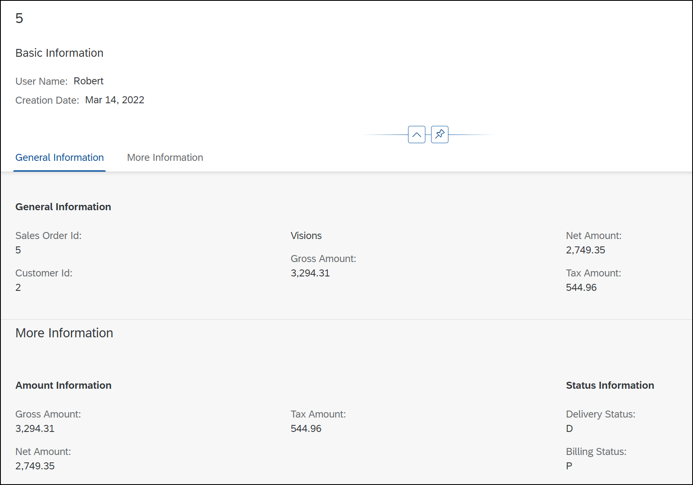
