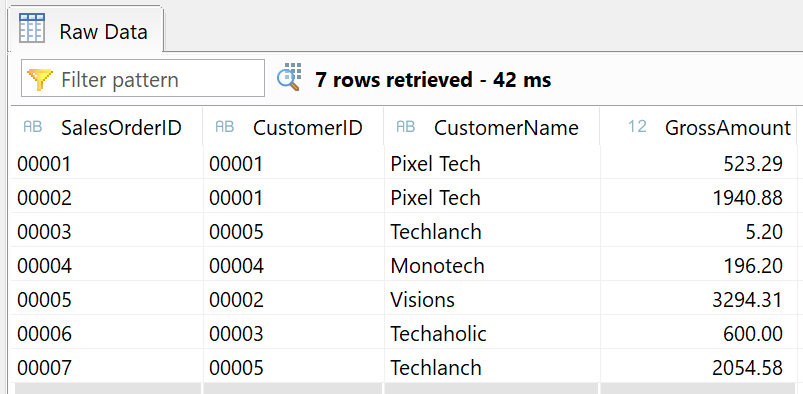
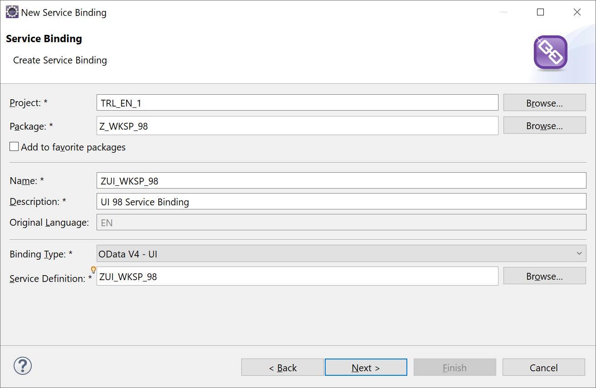
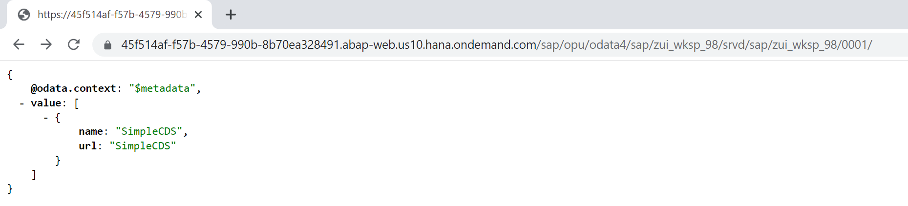
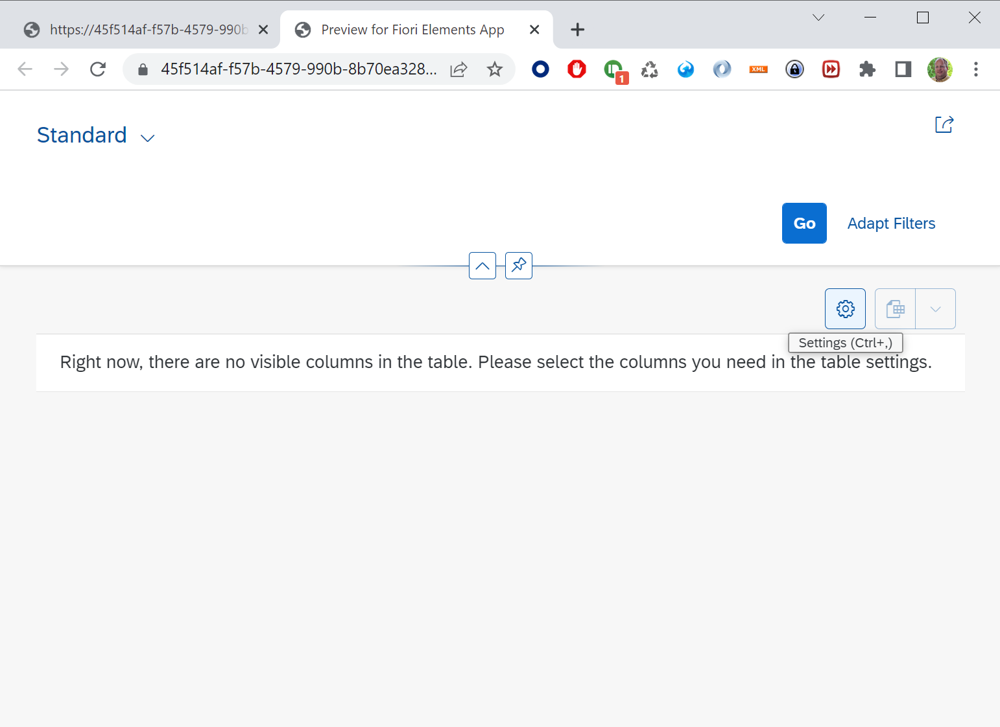
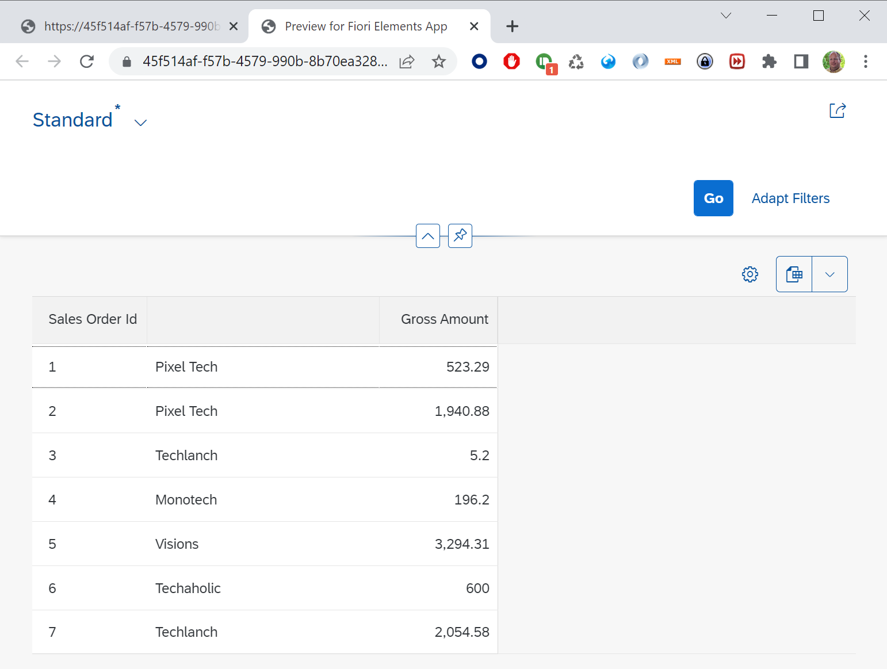
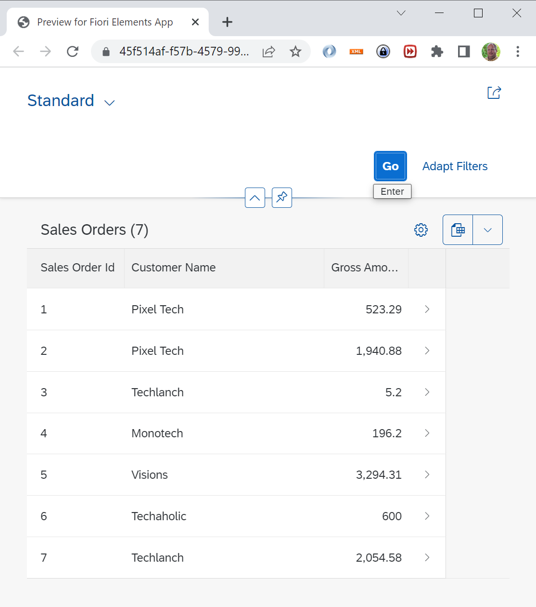

# Create a simple CDS

Create a simple CDS with name **ZWS##_CDS_SIMPLE** where ## is your number.</br>
Add the fields: Id, CustomerId, _Customer.name and GrossAmount.</br>
>Template:

```ABAP CDS
@AbapCatalog.sqlViewName: 'ZWK##CDSSIMPLE'
@AbapCatalog.compiler.compareFilter: true
@AbapCatalog.preserveKey: true
@AccessControl.authorizationCheck: #CHECK
@EndUserText.label: 'Simple CDS'
define view ZWS##_CDS_Simple as select from ztmcds9_i_so {
    key Id as SalesOrderID,
    CustomerId as CustomerID,
    _Customer.name as CustomerName,
    GrossAmount
}
```

Activate your CDS using CTRL-F3.</br>
Test your CDS by opening it with **Data Preview**. This should result in a list of records.


## Create Service Definition

You are going to create a Service Definition in which you can list all the CDS views you want to expose in a OData service.</br>
Right click on your Package and select *New* **Other ABAP Repository Object**, then type *Service* and select **Service Definition**.</br>
Enter Name **ZUI_WKSP_##** and enter a description.

>Hint: Naming conventions are often used to specify if the service definition is used as a UI or API service.

Add your CDS as the entity name and give it a nice name like SimpleCDS.

```ABAP
@EndUserText.label: 'UI ## Service Definition'
define service ZUI_WKSP_## {
    expose ZWS##_CDS_Simple as SimpleCDS; 
}
```

## Create Service Binding

Now we are going to expose the Service Definition by creating a Service Binding.</br>
Right click on your Package and select *New* **Other ABAP Repository Object**, then type *Service* and select **Service Binding**.</br>
Enter Name **ZUI_WKSP_##** and enter a description. Then select *Binding Type* **OData V4 - UI**, and then enter your Service Definition. You can start typing the first letters of your Service Definition and then use CTRL+SPACE for Auto Complete, or use the <kbd>Browse</kbd> button.</br>

Activate your Service Binding and then push Publish (this may take a few seconds). Your Service Binding is now ready to be used.</br>
If you press the ServiceURL a browser will be started and it will open the ROOT URL for your service.
>

If you select an Entity Set and press the <kbd>Preview</kbd> button, it will open a browser with an example application. But you still need to goto the settings to select the columns you want to display.
> 
> 

## Add Some UI Annotiations

Now add some annotiations to make the Preview application display lines directly without have to go to the settings.</br>
Add Header to table and select by default the Sales Order Id, CustomerName and GrossAmount.</br></br>
> Hint: @UI.headerInfo, @UI.lineItem

When you have added the annotations to your CDS, open the Preview again and see the result.

## Option 1, Annotations in your CDS

```ABAP CDS
@AbapCatalog.sqlViewName: 'ZWK##CDSSIMPLE'
@AbapCatalog.compiler.compareFilter: true
@AbapCatalog.preserveKey: true
@AccessControl.authorizationCheck: #CHECK
@EndUserText.label: 'Simple CDS'
@UI.headerInfo.typeName: 'Sales Order'
@UI.headerInfo.typeNamePlural: 'Sales Orders'
define view ZWS##_CDS_Simple as select from ztmcds9_i_so {
@UI.lineItem: [{position: 10 }]
    key Id as SalesOrderID,
    CustomerId as CustomerID,
@UI.lineItem: [{position: 20 },{ label: 'Customer Name' }]    
    _Customer.name as CustomerName,
@UI.lineItem: [{position: 30 }]    
    GrossAmount
}
```

## Option 2, use a Metadata Extension

Create a Metadata Extension for your CDS.
Add the annotation **@Metadata.allowExtensions: true** to your Simple CDS above the *define* line.</br>

```ABAP CDS
@AbapCatalog.sqlViewName: 'ZWS##CDSBASIC'
@AbapCatalog.compiler.compareFilter: true
@AbapCatalog.preserveKey: true
@AccessControl.authorizationCheck: #CHECK
@EndUserText.label: 'Basic CDS'
@Metadata.allowExtensions: true
define view ZWS##_CDS_Basic as select from ztmcds9_i_so {
    key Id as SalesOrderID,
    CustomerId as CustomerID,
    _Customer.name as CustomerName,
    GrossAmount
}
```

Right click on your Package and select *New* **Other ABAP Repository Object**, then type *Core* and select **Metadata Extension**.</br>
And add the annotations for the fields to this file.

```ABAP CDS
@Metadata.layer: #CUSTOMER
@UI.headerInfo.typeName: 'Sales Order'
@UI.headerInfo.typeNamePlural: 'Sales Orders'
annotate view ZWS##_CDS_Basic with
{
  @UI.lineItem: [{position: 10 }]
  SalesOrderID;
  @UI.lineItem: [{position: 20 },{ label: 'Customer Name' }]
  CustomerName;
  @UI.lineItem: [{position: 30 }]
  GrossAmount;
}
```

> Result:
> </br>
