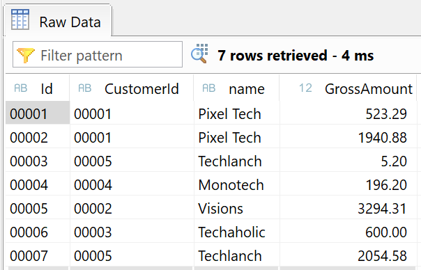
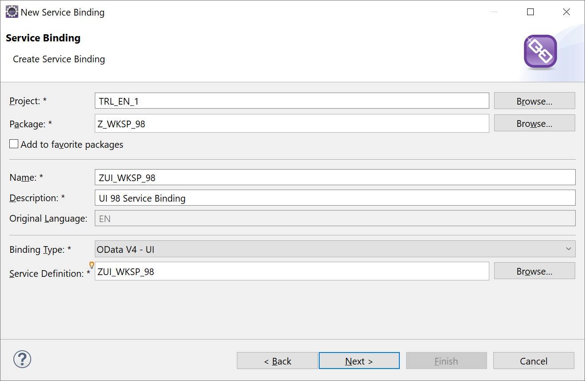
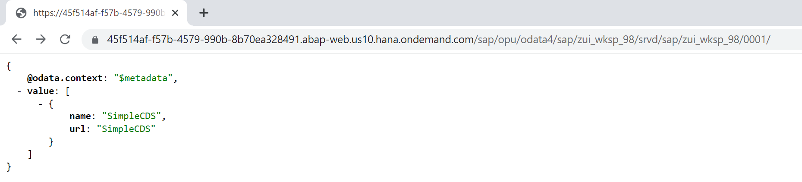
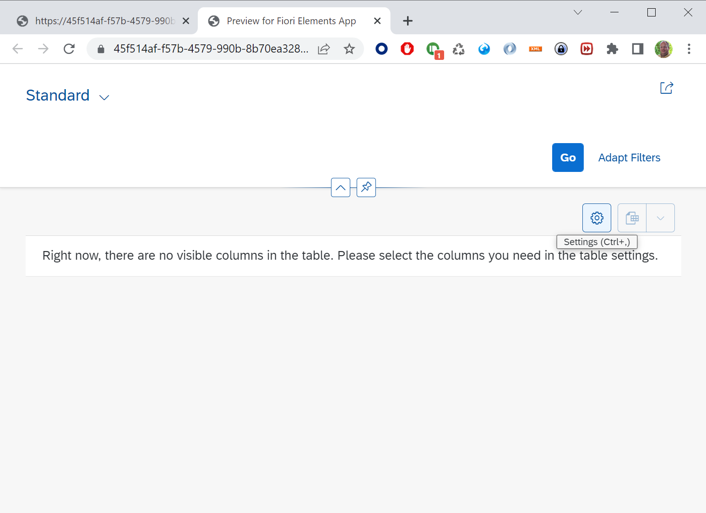
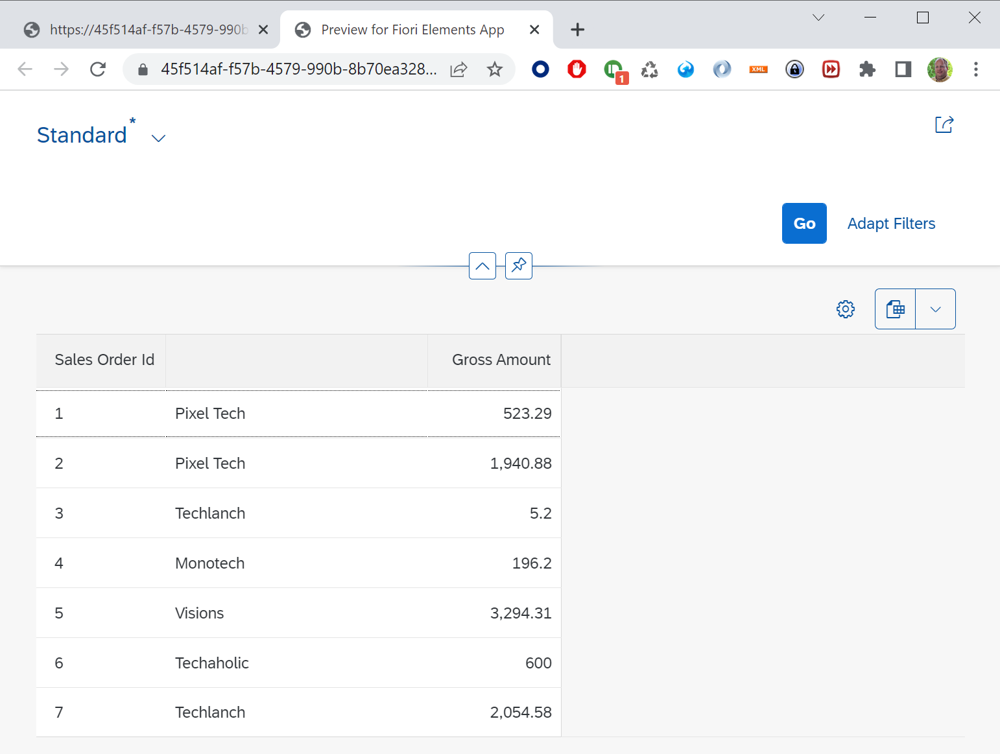

# Create a simple CDS
Create a simple CDS with name **ZWS##_CDS_SIMPLE** where ## is your number.</br>
Add the fields: Id, CustomerId, _Customer.name and GrossAmount.</br>
>Template:
```ABAP CDS
@AbapCatalog.sqlViewName: 'ZWK##CDSSIMPLE'
@AbapCatalog.compiler.compareFilter: true
@AbapCatalog.preserveKey: true
@AccessControl.authorizationCheck: #CHECK
@EndUserText.label: 'Simple CDS'
define view ZWS98_CDS_Simple as select from ztmcds9_i_so {
    key Id,
    CustomerId,
    _Customer.name,
    GrossAmount
}
```
Activate your CDS using CTRL-F3.</br>
Test your CDS by opening it with **Data Preview**. This should result in a list of records.


## Create Service Definition
You are going to create a Service Definition in which you can list all the CDS views you want to expose in a OData service.</br>
Right click on your Package and select *New* **Other ABAP Repository Object**, then type *Service* and select **Service Definition**.</br>
Enter Name **ZUI_WKSP_##** and enter a description.

>Hint: Naming conventions are often used to specify if the service definition is used as a UI or API service.

Add your CDS as the entity name and give it a nice name like SimpleCDS.
```ABAP
@EndUserText.label: 'UI 98 Service Definition'
define service ZUI_WKSP_## {
    expose ZWS##_CDS_Simple as SimpleCDS; 
}
```
## Create Service Binding
Now we are going to expose the Service Definition by creating a Service Binding.</br>
Right click on your Package and select *New* **Other ABAP Repository Object**, then type *Service* and select **Service Binding**.</br>
Enter Name **ZUI_WKSP_##** and enter a description. Then select *Binding Type* **OData V4 - UI**, and then enter your Service Definition. You can start typing the first letters of your Service Definition and then use CTRL+SPACE for Auto Complete, or use the *Browse* button.</br>

Activate your Service Binding and then push Publish (this may take a few seconds). Your Service Binding is now ready to be used.</br>
If you press the ServiceURL a browser will be started and it will open the ROOT URL for your service.
>

If you select an Entity Set and press the *Preview* button, it will open a browser with an example application. But you still need to goto the settings to select the columns you want to display.
> 

>