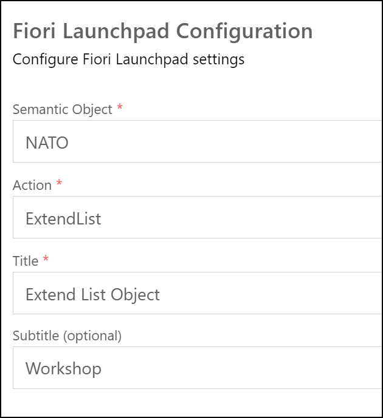

# Extend Fiori Elements List Report Object Page Application

## Task 1: Create a Fiori elements Extension application **

Create a new Fiori Application using the Template Wizard for a *List Report*
| Field | Value |
|-|-|
| Data source | Connect to a System |
| System | abap-cloud-default_xx-dev (BTP) |
| Service | ZUI_WKSP_## |
| Main entity | ListObject |
| Module name | extend-object |
| Application title | Extend List Object |
| Application namespace | nato.workshop |
| Description | Extend List Object |
| Project folder path | /home/user/projects |
| Add deployment configuration | Yes |
| Add FLP configuration | Yes |
| Deployment Target | Cloud Foundry |
| Destination name | abap-cloud-default_xx(SCP)  |
| Add application to managed application router | Yes |
| Semantic Object | NATO |
| Action | ExtendList |
| Title | Extend List Object |
| Subtitle | Workshop |

* Entity Selection</br>
* Project Attributes</br>
* Fiori Launchpad Configuration</br>
* Preview Application</br>

## Task 2: Add extra column to Table

* Start the *Guided Development* and select **Add and edit table columns**</br>
* Select **ListObjectType** as the *Entity Type*</br>
* Press button *Add Column*</br>
* Enter **NetAmmount** as the *Property* and *Insert Snippet*</br>
* Preview Application</br>

## Task 3: Add a custom Action

* Start the *Guided Development* and select **Add a custom action to a page using extensions**</br>
* *Start Guide*
* Select **List Report Page** in *Page*, enter **onCalculate** as *Function Name* and Press *Insert Snippet* followed by *Next*</br>
* This will add a new *folder* **custom** and new *file* **ListReportExtController.js** with a template snippet for the javascript code</br>
* At the next step set the following parameters, *Insert Snippet* and *Exit Guide*

| Name | Value |
|-|-|
| Entity Set | ListObject |
| Action Position | Table Toolbar |
| Action ID | Calculate |
| Button Text | Calculate Difference |
| Row Selection | yes |

* 
* Manifest.json file is updated
* Preview Application</br>
* Select a line and press the **Calculate Difference** button</br>
* Now implement the javascript template in the new **ListReportExtController.js**, Calculate the difference between de *GrossAmount* and *NetAmount* and show it using a MessageBox

```Javascript
sap.ui.define([
    "sap/m/MessageBox"
],
function (MessageBox){
    "use strict";
    return {
        onCalculate: function(oEvent) {
            let nGrossAmount = parseFloat(this.getSelectedContexts()[0].getObject().GrossAmount);
            let nNetAmount = parseFloat(this.getSelectedContexts()[0].getObject().NetAmount);
            let nDiff = nGrossAmount - nNetAmount;
            MessageBox.success("Difference = " + nDiff);
        }
    };
});
```

* 