# Extend Fiori Elements Overview Page Application

## Task 1: Create a new Extension application CDS/OData V2

* Create a new Fiori Application using the Template Wizard for a *Overview Page*

| Field | Value |
|-|-|
| Data source | Connect to a System |
| System | abap-cloud-default_xx-dev (BTP) |
| Service | ZUI_WKSP_##_V2 |
| Main entity | OverviewPageType |
| Module name | extend-ovp |
| Application title | Extend Overview Page |
| Application namespace | nato.workshop |
| Description | Extend Overview Page |
| Project folder path | /home/user/projects |
| Add deployment configuration | Yes |
| Add FLP configuration | Yes |
| Deployment Target | Cloud Foundry |
| Destination name | abap-cloud-default_xx(SCP)  |
| Add application to managed application router | Yes |
| Semantic Object | NATO |
| Action | ExtendOVP |
| Title | ExtendOVP |
| Subtitle | Workshop |

* Open the manifest.json file and add **"useBatch": false,** to the *settings* part of the *mainModel*</br>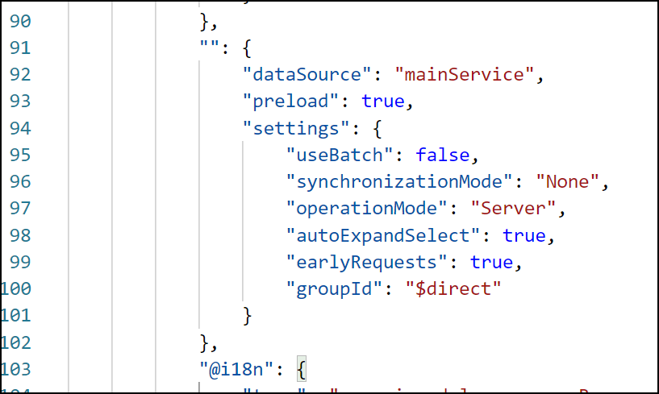

## Task 2: Add a table card

* Start a *Guided Development* for **Add a table card to an overview page**
* In *Step 5* use following **New Card Parameters**

|Name|Value|
|-|-|
|Model|mainModel|
|Entity Set|OverviewPage|
|Card ID|Card00|

* 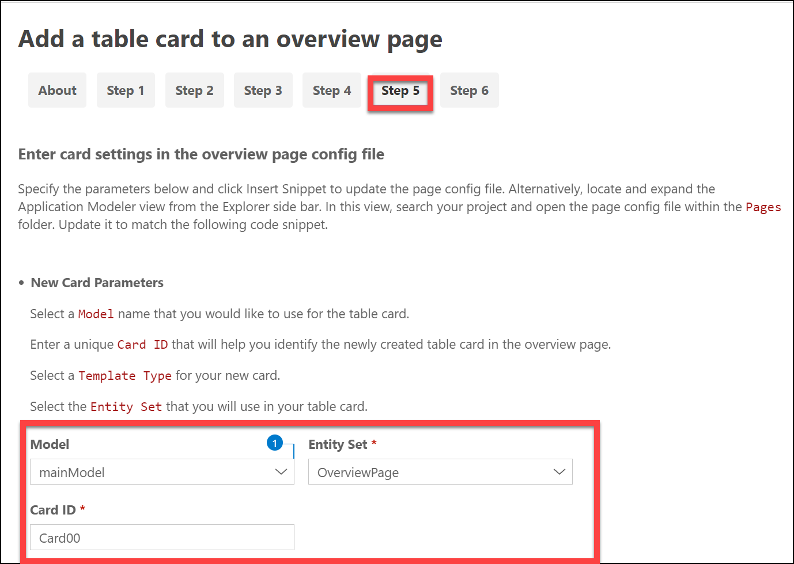
* Add following **Table Card Settings Paramters**

|Name|Value|
|-|-|
|Title|{{card00_title}}|
|Entity Type|OverviewPageType|
|Tabs|No|

* *Insert Snippet*</br>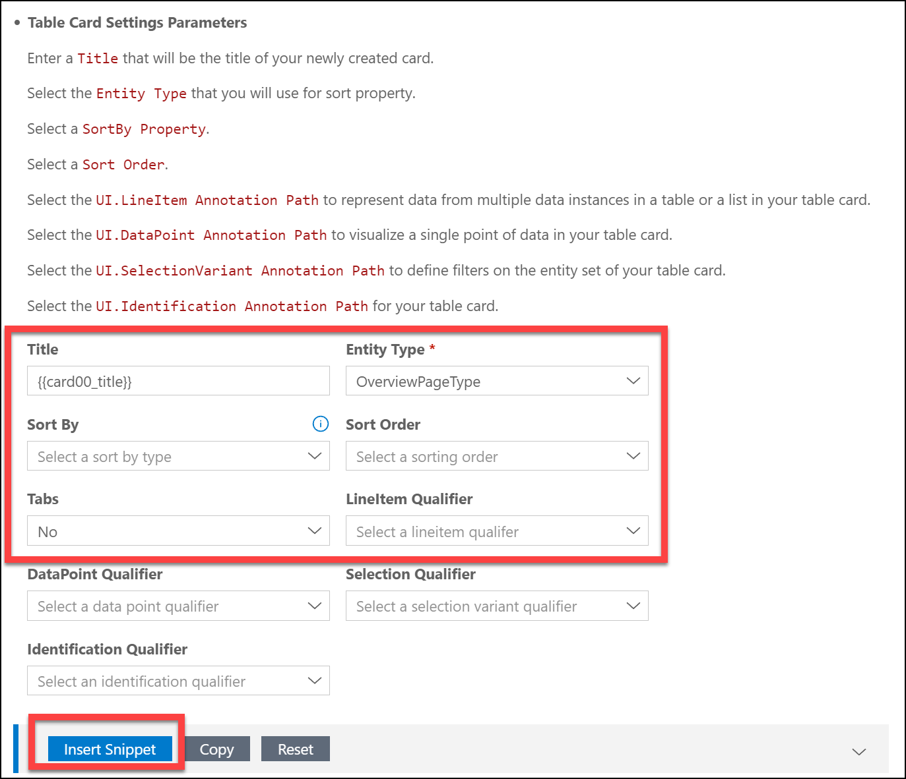
* OverviewPage.josn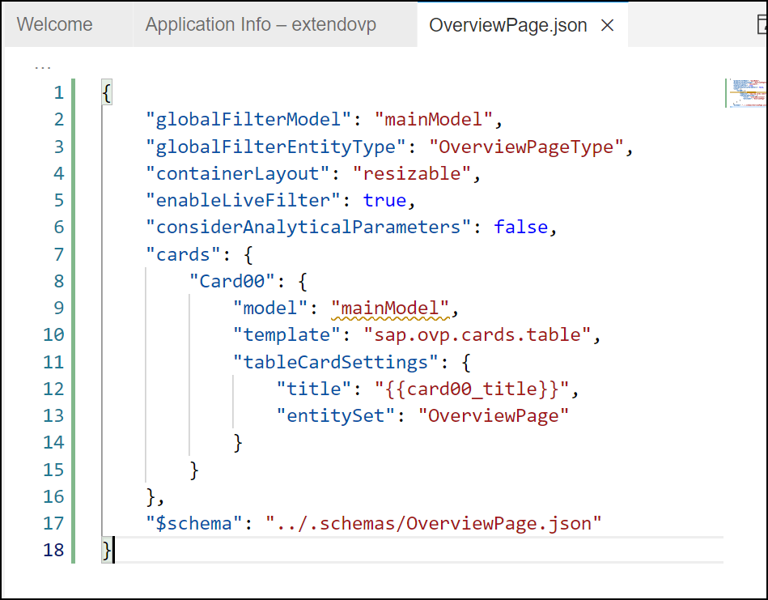
* Preview Application</br>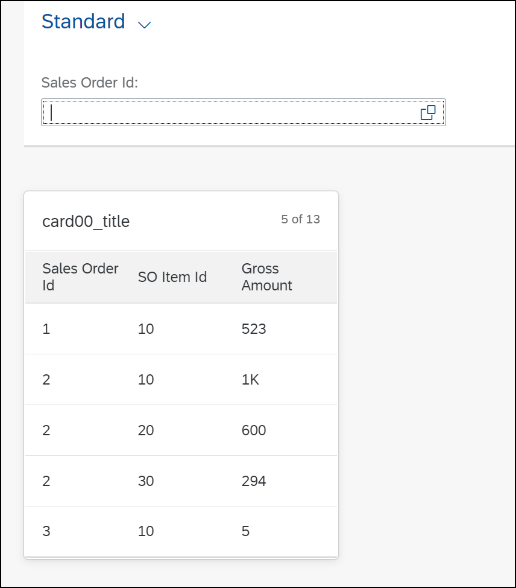

## Task 3: Add a custom filter to the filter bar

* Add **card00_title=Recent Sales** **card01_title=Recent Products sold** to *i18n.properties*

```javascript
#XTIT: Card00_title
card00_title=Recent Sales

#XTIT: Card01_title
card01_title=Recent Products sold
```

* Start a *Guided Development* for **Add a custom filter to the filter bar**</br>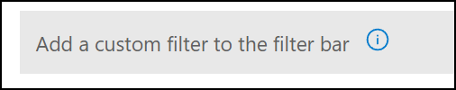
* In *Step 1* use following parameters

|Name|Value|
|-|-|
|Fragment File Name|CustomFilter|
|Custom Filter Key|CustomProductName|
|Custom Filter Name|Custom Product Name|
|Control ID|CustomProductName|

* *Insert Snippet* and *Next*</br>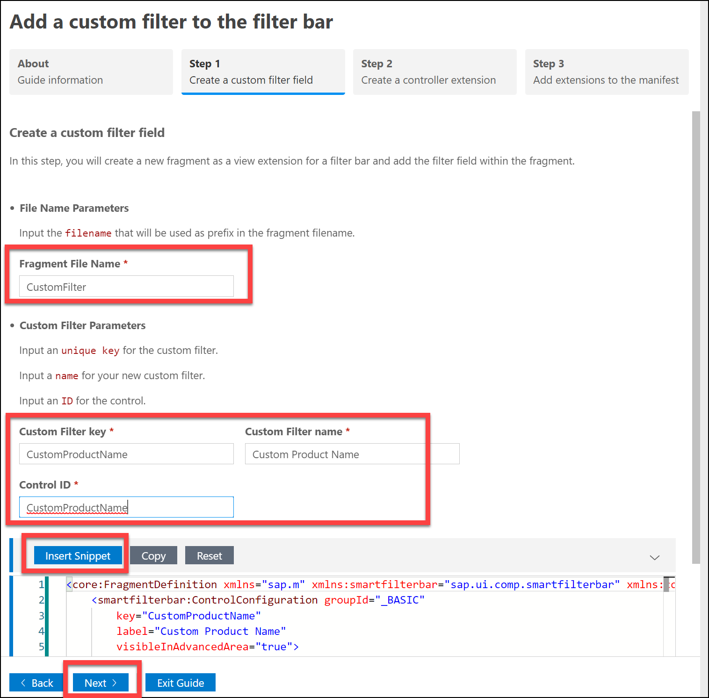
* This creates a new folder **ext**/**fragments** with file **CustomFilter.fragment.xml**</br>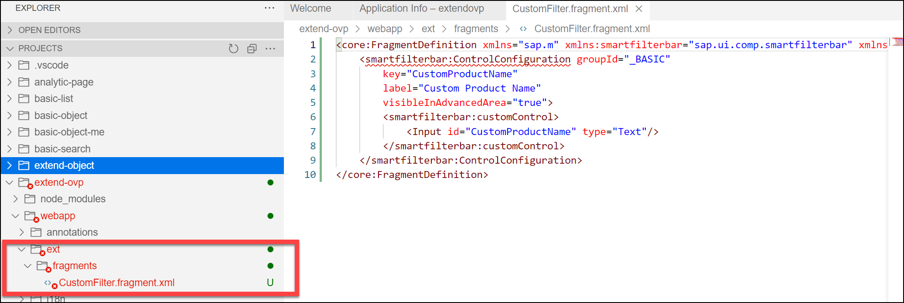
* In *Step 2* use following parameters

|Name|Value|
|-|-|
|Model|mainModel|
|Entity Type|OverviewPageType|
|Entity Type Property|ProductName|
|Custom Filter Property|ProductName|

* *Insert Snippet* and *Next*</br>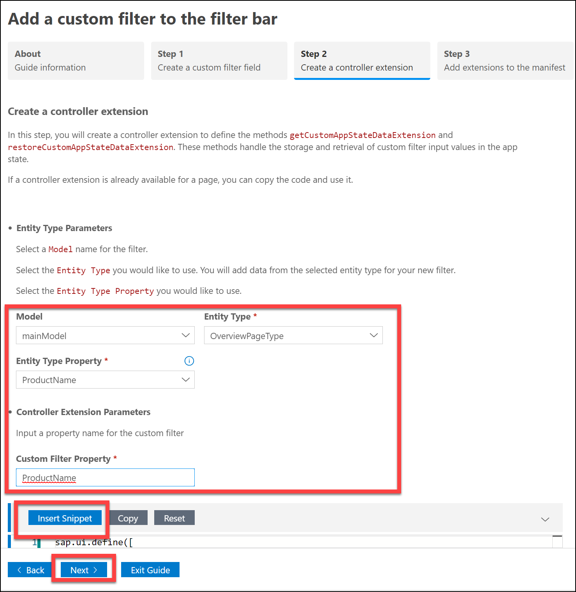
* This creates a new folder **ext**/**controller** with file **OverViewPageExt.controller.js**</br>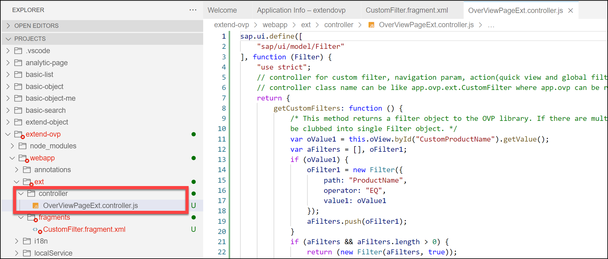
* In *Step 3* *Insert Snippet* and *Exit Guide*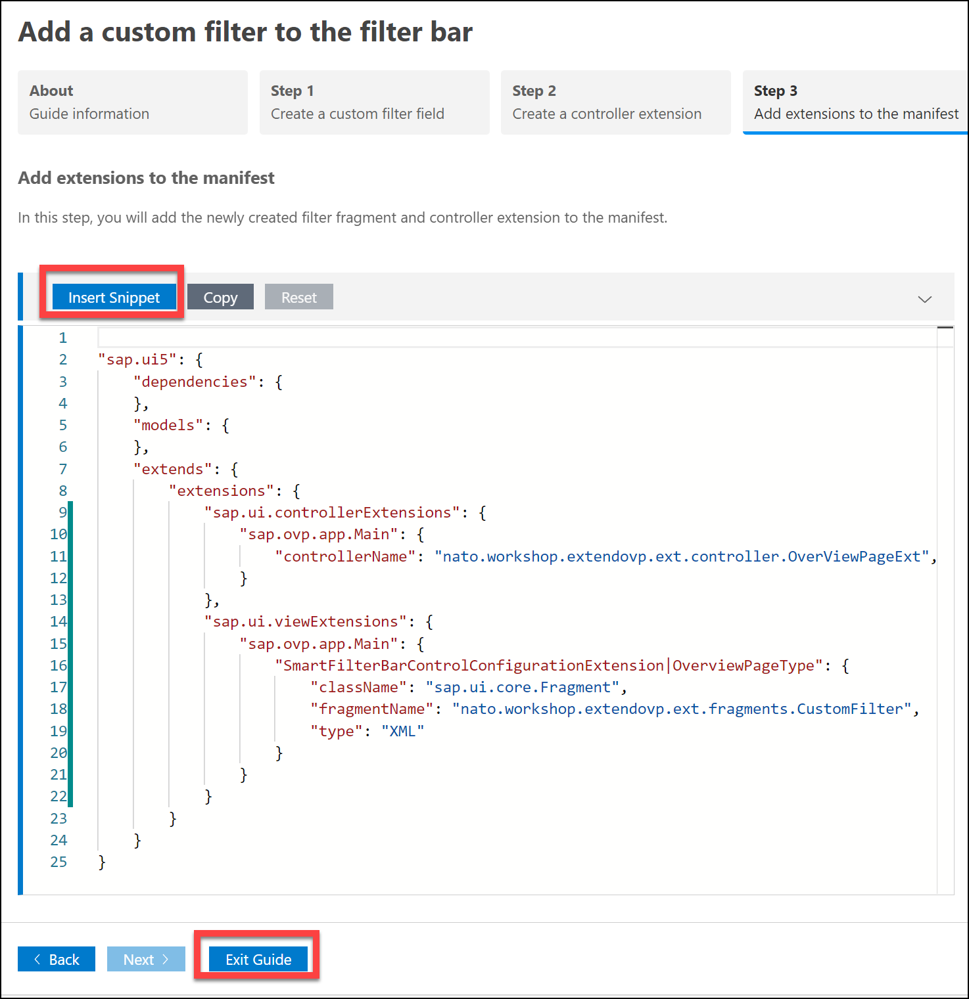
* Implement **CustomFilter.fragment.xml** by adding a *Select*

```xml
<core:FragmentDefinition xmlns="sap.m" xmlns:smartfilterbar="sap.ui.comp.smartfilterbar" xmlns:core="sap.ui.core">
    <smartfilterbar:ControlConfiguration id="CustomFilter" groupId="_BASIC" 
        key="CustomProductName"
        label="Custom Product Name"
        visibleInAdvancedArea="true">
        <smartfilterbar:customControl>
            <Select id="CustomProductName">
                <core:Item id="all" text="All" key="All"/>
                <core:Item id="Gal" text="Galaxy" key="Gal"/>
                <core:Item id="Sub" text="Subscription" key="Sub"/>
            </Select>
        </smartfilterbar:customControl>
    </smartfilterbar:ControlConfiguration>
</core:FragmentDefinition>
```

* Implement **OverViewPageExt.controller.js**

```javascript
sap.ui.define([
    "sap/ui/model/Filter",
    "sap/ui/model/FilterOperator"
], function (Filter,FilterOperator) {
    "use strict";
    // controller for custom filter, navigation param, action(quick view and global filter), navigation target 
    // controller class name can be like app.ovp.ext.CustomFilter where app.ovp can be replaced with your application namespace
    return {
        getCustomFilters: function () {
            /* This method returns a filter object to the OVP library. If there are multiple filters, they should 
            be clubbed into single Filter object. */
            var sSelectedKey = this.oView.byId("CustomProductName").getSelectedKey();
            var aFilters = [], oFilter1;

            switch (sSelectedKey){
                case "All":
                    break;
                case "Gal":
                    oFilter1 = new Filter({path:"ProductName", operator: FilterOperator.StartsWith, value1: "Gal"})
                    aFilters.push(oFilter1);
                    break;
                case "Sub":
                    oFilter1 = new Filter({path:"ProductName", operator: FilterOperator.NotStartsWith, value1: "Gal"})
                    aFilters.push(oFilter1);
                    break;
                }

            if (aFilters && aFilters.length > 0) {
                return (new Filter(aFilters, true));
            }
        },
        getCustomAppStateDataExtension: function (oCustomData) {
            //the content of the custom field will be stored in the app state, so that it can be restored later, for example after a back navigation.
            //The developer has to ensure that the content of the field is stored in the object that is returned by this method.
            if (oCustomData) {
                var oCustomField1 = this.oView.byId("CustomProductName");
                if (oCustomField1) {
                    oCustomData.ProductName = oCustomField1.getSelectedKey();
                }
            }
        },
        restoreCustomAppStateDataExtension: function (oCustomData) {
            //in order to restore the content of the custom field in the filter bar, for example after a back navigation,
            //an object with the content is handed over to this method. Now the developer has to ensure that the content of the custom filter is set to the control
            if (oCustomData) {
                if (oCustomData.ProductName) {
                    var oCustomField1 = this.oView.byId("CustomProductName");
                    oCustomField1.setValue(oCustomData.ProductName);
                }
            }
        }
    }
});
````

* Preview Application</br>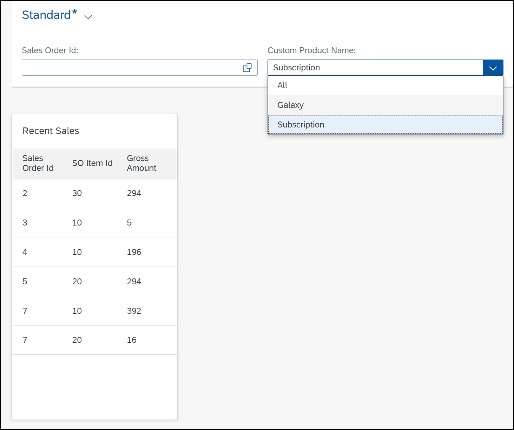

## Task 4: Add a custom card

* Start a *Guided Development* for **Add a custom card to an overview page**</br>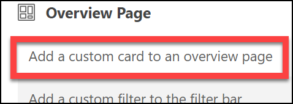
* In *Step 1* use following parameters

|Name|Value|
|-|-|
|Folder name|customCard|
|Card ID|card01|
|Fragment file name prefix|CustomCardContent|
|Controller file name prefix|CustomCard|

*Insert Snippet* and *Next*</br>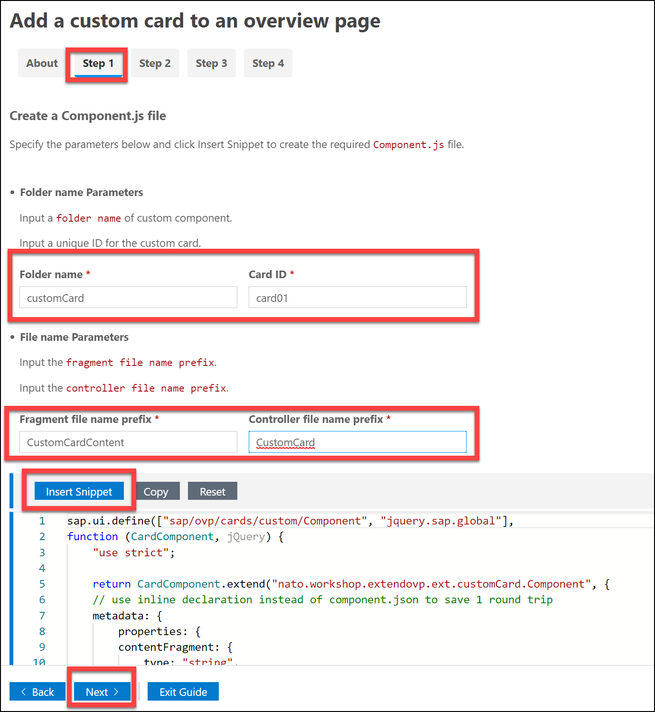

* This creates a new folder **customCard** with file **Component.js**</br>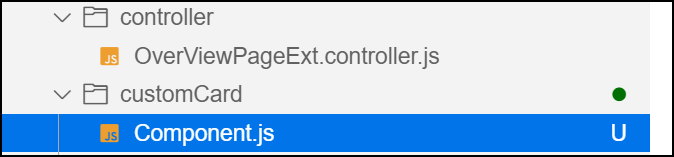
* In *Step 2* *Insert Snippet* and *Next*</br>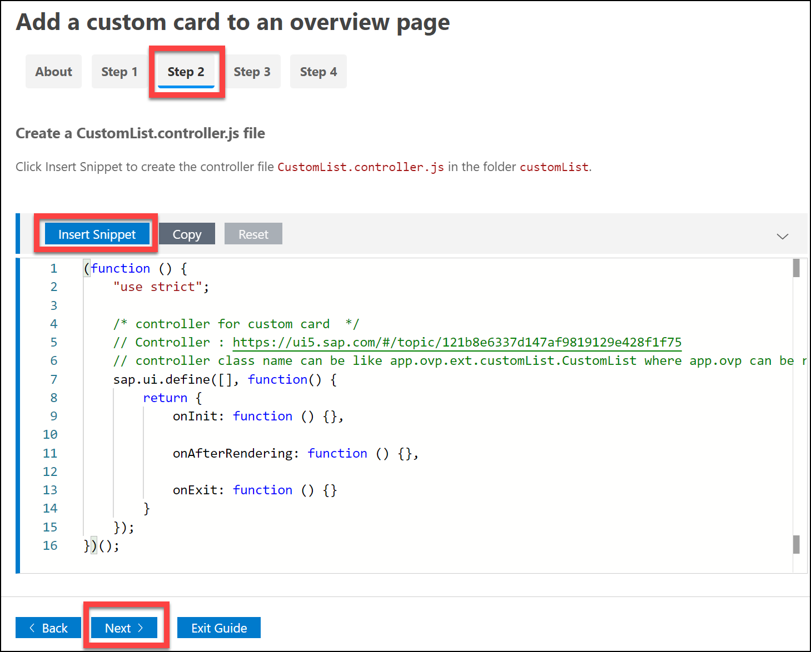
* This creates a new file **CustomCard.controller.js**</br>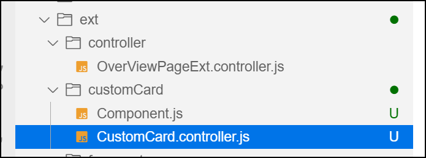
* In *Step 3* *Insert Snippet* and *Next*</br>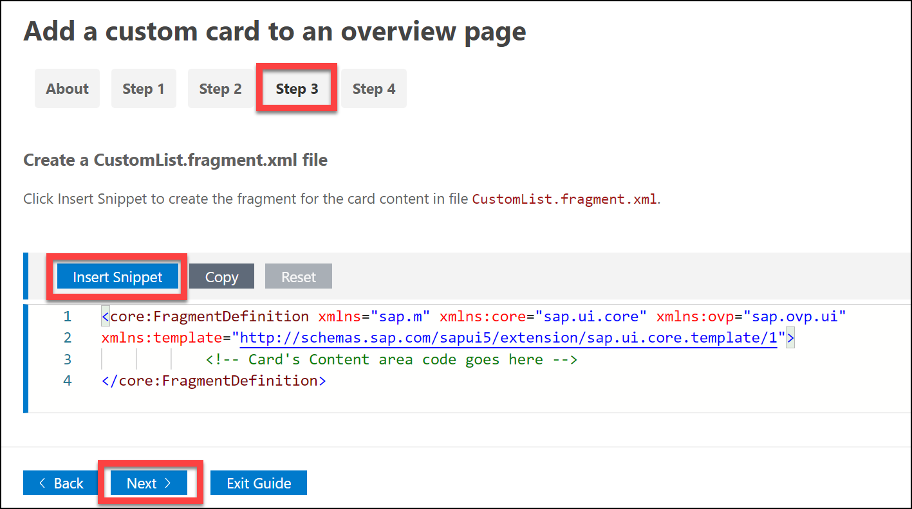
* This creates a new file **CustomCardContent.fragment.xml**</br>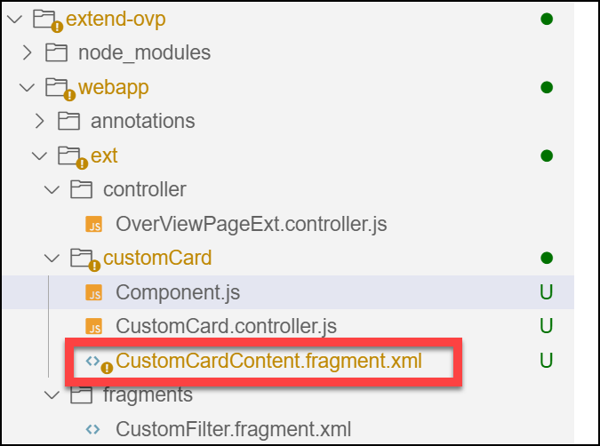
* In *Step 4* *Insert Snippet* and *Exit Guide*</br>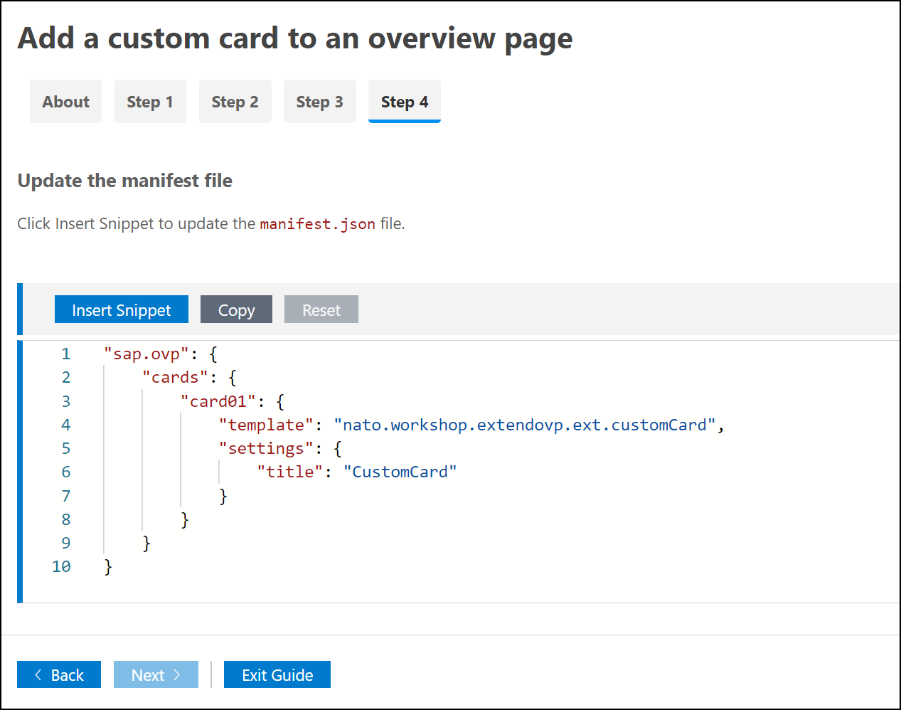
* Duplicate the **CustomCardContent.fragment.xml** file to **CustomCardHeader.fragment.xml**, because we also want a header in our custom card</br>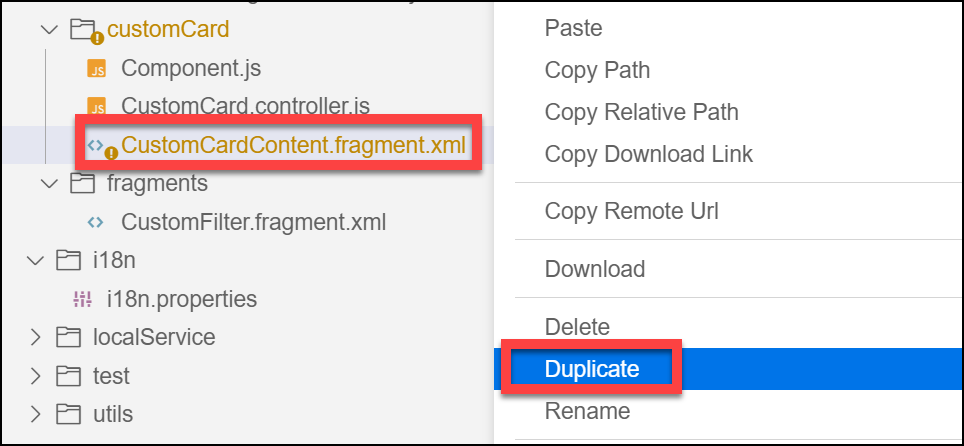
* CustomCardHeader.fragment.xml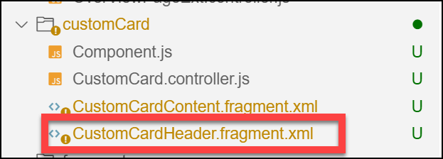
* in file **ext/customCard/Component.js** copy the *defaultValue* from **ContentFragment** to **headerFragment** and change it to **CustomCardHeader**</br>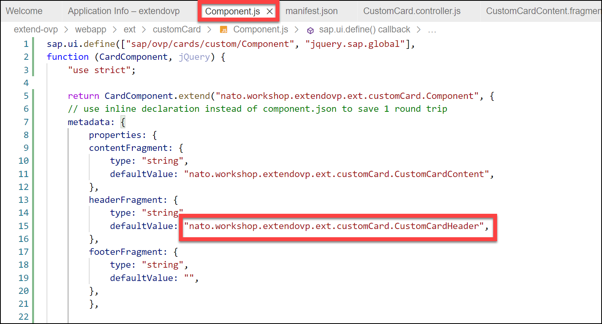
* Implement **CustomCardHeader.fragment.xml**

```xml
<core:FragmentDefinition xmlns="sap.m" xmlns:core="sap.ui.core" xmlns:ovp="sap.ovp.ui"
xmlns:template="http://schemas.sap.com/sapui5/extension/sap.ui.core.template/1">
    <VBox id="idVbox">
    <Title id="idTitle" text="{i18n>card01_title}" class="sapUiSmallMargin"/>
    </VBox>
</core:FragmentDefinition>
```

*Implement **CustomCardContent.fragment.xml**

```xml
<core:FragmentDefinition xmlns="sap.m" xmlns:core="sap.ui.core" xmlns:ovp="sap.ovp.ui"
xmlns:template="http://schemas.sap.com/sapui5/extension/sap.ui.core.template/1">
    <List id="idList" items="{ path: '/OverviewPage', templateShareable: false}"
         growing="true"
         growingThreshold="3">
        <items>
            <StandardListItem id="idSLI" title="{ProductId}" description="{ProductName}"/>
        </items>
    </List>
</core:FragmentDefinition>
```

* Preview Application</br>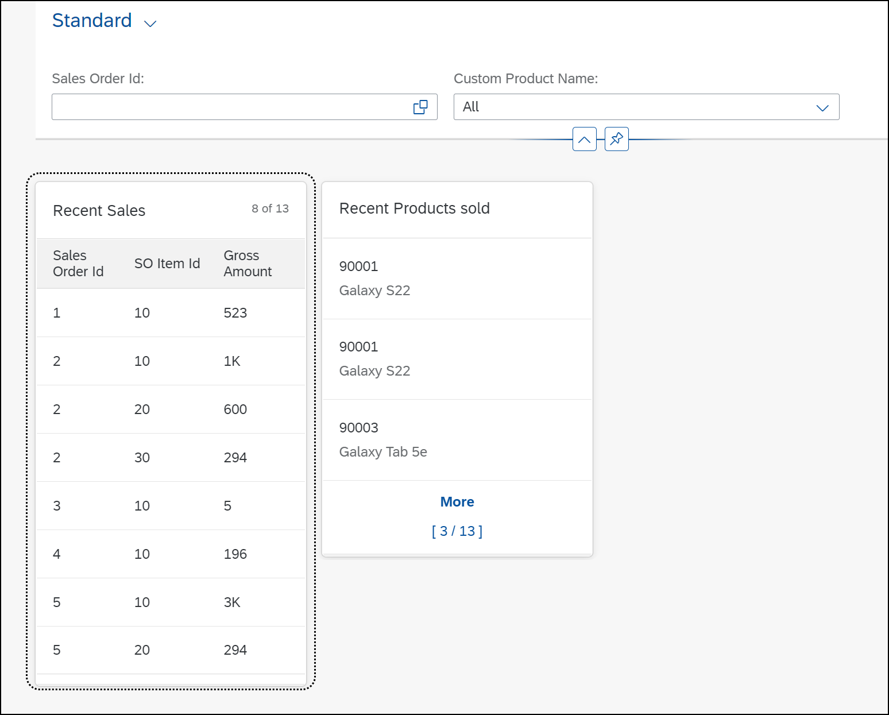

[Back to Exercises](../README.md)
