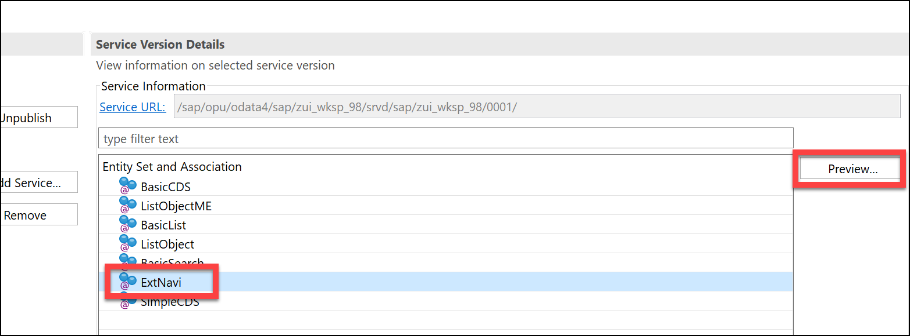
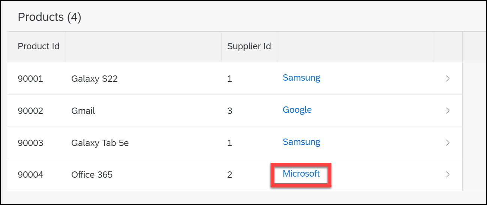
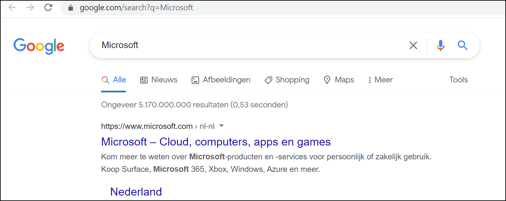
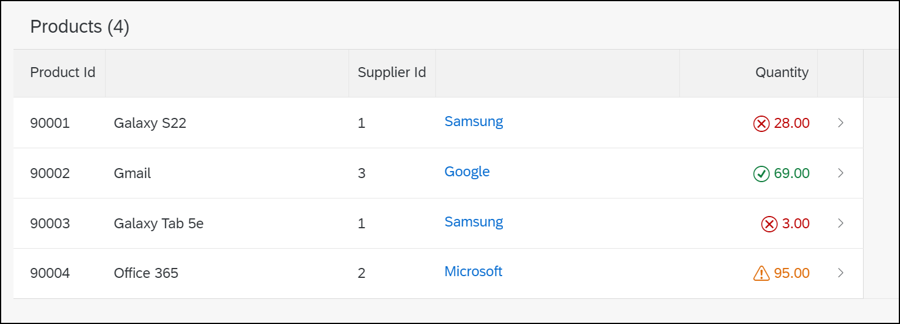

# External Navigation and Visualization

## Task 1: New CDS **ZWS##_CDS_NAV_EXT**

* Create a new CDS **ZWS##_CDS_NAV_EXT** based on **ztmdt9_products** with an assosiation to **ztmdt9_suppliers**
* Add fields

| Position | Field | Name |
| - | - | - |
| 10 | id | ProductId |
| 20 | name |
| 30 | supplier_id |
| 40 | _Supplier.name | SupplierName |

* Make the field SupplierName an external link to *<https://www.google.com/search?q>=**SupplierName***.
* Add the new CDS to your *Service Definition* and use the *Preview* option in your *Service Binding* to test your result.

```ABAP CDS
@AbapCatalog.sqlViewName: 'ZWS##CDSNAVEXT'
@AbapCatalog.compiler.compareFilter: true
@AbapCatalog.preserveKey: true
@AccessControl.authorizationCheck: #CHECK
@EndUserText.label: 'Navigate to external link'
@UI.headerInfo.typeNamePlural: 'Products'
define view ZWS##_CDS_NAV_EXT
  as select from ztmdt9_products
  association [1] to ztmdt9_suppliers as _Supplier on _Supplier.id = ztmdt9_products.supplier_id
{
      @UI.lineItem: [{ position: 10 }]
  key id                                                         as ProductId,
      @UI.lineItem: [{ position: 20 }]
      name                                                       as ProductDescription,
      @UI.lineItem: [{ position: 30 }]
      supplier_id                                                as SupplierId,
      @UI.lineItem: [{ position: 40, url: 'SearchURL', type: #WITH_URL }]
      _Supplier.name                                             as SupplierName,
      @UI.hidden: true
      concat('https://www.google.com/search?q=', _Supplier.name) as SearchURL
}
```

---

```ABAP
@EndUserText.label: 'UI ## Service Definition'
define service ZUI_WKSP_## {
  expose ZWS##_CDS_Simple as SimpleCDS;
  expose ZWS##_CDS_Basic as BasicCDS;
  expose ZWS##_CDS_LIST as BasicList;
  expose ZWS##_CDS_LIST_SEARCH as BasicSearch;
  expose ZWS##_CDS_LIST_OBJECT as ListObject;
  expose ZWS##_CDS_C_LO as ListObjectME;
  expose ZWS##_CDS_NAV_EXT as ExtNavi;
}
```

* Preview

* Result
* Navigation

## Task 2: Add visualization

* Add the fields *uom* and *stock* to the view
* When the stock is < 30 then color it Red
* When the stock is > 80 then color it Orange
* Else then color green

```ABAP CDS
@AbapCatalog.sqlViewName: 'ZWS##CDSNAVEXT'
@AbapCatalog.compiler.compareFilter: true
@AbapCatalog.preserveKey: true
@AccessControl.authorizationCheck: #CHECK
@EndUserText.label: 'Navigate to external link'
@UI.headerInfo.typeNamePlural: 'Products'
define view ZWS##_CDS_NAV_EXT
  as select from ztmdt9_products
  association [1] to ztmdt9_suppliers as _Supplier on _Supplier.id = ztmdt9_products.supplier_id
{
      @UI.lineItem: [{ position: 10 }]
  key id                                                         as ProductId,
      @UI.lineItem: [{ position: 20 }]
      name                                                       as ProductDescription,
      @UI.lineItem: [{ position: 30 }]
      supplier_id                                                as SupplierId,
      @UI.lineItem: [{ position: 40, url: 'SearchURL', type: #WITH_URL }]
      _Supplier.name                                             as SupplierName,
      @UI.hidden: true
      concat('https://www.google.com/search?q=', _Supplier.name) as SearchURL,
      @Semantics.unitOfMeasure: true
      uom,
      @UI.lineItem: [{ position: 50, criticality: 'StockLevelCritical' }]
      stock,
      @UI.hidden: true
      case when stock < 30 then 1
      when stock > 80 then 2
      else 3 end                                                 as StockLevelCritical
}
```

* Result

[Back to Exercises](../README.md)
