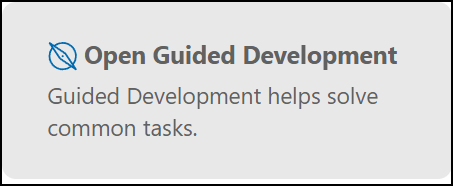
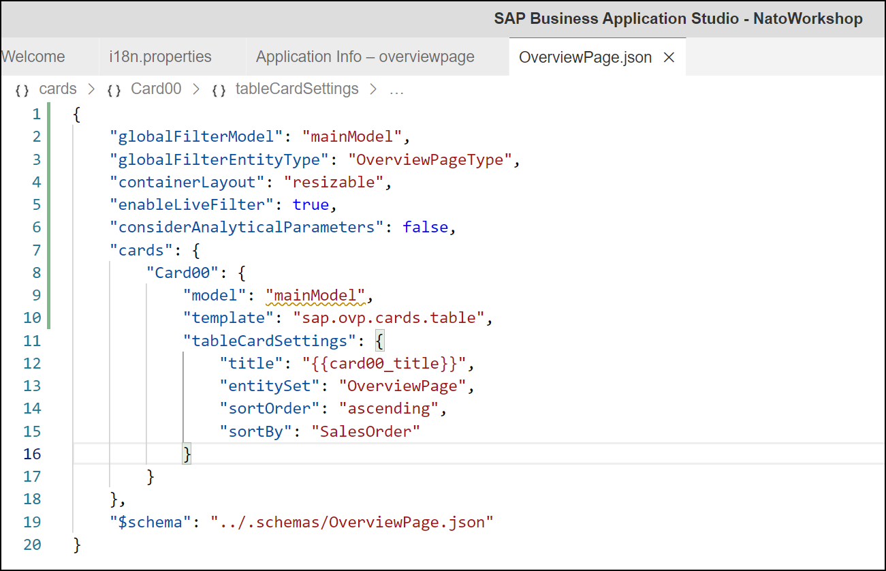

# Overview Page

## Task 1: Create new CDS **ZWS##_CDS_OVP**

* Create a new CDS based on cds *ZTMCDS9_I_SO_ITEMS*
* Set annotation *@Metadata.allowExtensions: true*
* Add fields:

| Field |
| - |
| SoId as SalesOrder |
| Id as SalesOrderItem |
| CustomerName |
| ProductId |
| ProductName |
| CurrencyCode |
| GrossAmount |
| NetAmount |
| 'sap-icon://sales-order' as SAPIconUrl |

```ABAP CDS
@AbapCatalog.sqlViewName: 'ZWK##CDSOVP'
@AbapCatalog.compiler.compareFilter: true
@AbapCatalog.preserveKey: true
@AccessControl.authorizationCheck: #CHECK
@EndUserText.label: 'Overview Page'
@Metadata.allowExtensions: true
define view ZWS##_CDS_OVP
  as select from ZTMCDS9_I_SO_ITEMS
{
  key SoId as SalesOrder,
  key Id as SalesOrderItem,
      CustomerName,
      ProductId,
      ProductName,
      CurrencyCode,
      GrossAmount,
      NetAmount,
      'sap-icon://sales-order' as SAPIconUrl
}
```

## Task 2: Create Metadata Extension **ZWS##_ME_CDS_OVP**

* Create new Metadata Extenstion
* Set annotations

| Field | Annotation |
| - | - |
| SalesOrder | lineItem position 10 |
| SalesOrder | selectionField position 10 |
| SalesOrderItem | lineItem position 20 |
| GrossAmount | lineItem position 30 |

```ABAP CDS
@Metadata.layer: #CUSTOMER
annotate view ZWS##_CDS_OVP with
{
  @UI.lineItem: [{ position: 10 }]
  @UI.selectionField: [{ position: 10 }]
  SalesOrder;
  @UI.lineItem: [{ position: 20 }]
  SalesOrderItem;
  @UI.lineItem: [{ position: 30 }]
  GrossAmount;
}
```

## Task 3: Add **ZWS##_CDS_OVP** to *Service Definition*

* Add this new CDS to your *Service Definition* as OverviewPage

```ABAP
@EndUserText.label: 'UI ## Service Definition'
define service ZUI_WKSP_## {
  expose ZWS##_CDS_Simple as SimpleCDS;
  expose ZWS##_CDS_Basic as BasicCDS;
  expose ZWS##_CDS_LIST as BasicList;
  expose ZWS##_CDS_LIST_SEARCH as BasicSearch;
  expose ZWS##_CDS_LIST_OBJECT as ListObject;
  expose ZWS##_CDS_C_LO as ListObjectME;
  expose ZWS##_CDS_NAV_EXT as ExtNavi;
  expose ZWS##_CDS_OVP as OverviewPage;
}
```

## Task 4: Create Service Binding OData V2 **ZUI_WKSP_##_V2**

* For Overview Pages we need to have a OData V2 service
* Create a new Service Binding with name **ZUI_WKSP_##_V2**
* Use *Binding Type* **OData V2 - UI**
* 
* Publish  the new Service Binding
* 

## Task 5: Create a new Fiori elements application with the new CDS/OData V2

Create a new Fiori Application using the Template Wizard for a *Overview Page*
| Field | Value |
|-|-|
| Data source | Connect to a System |
| System | abap-cloud-default_xx-dev (BTP) |
| Service | ZUI_WKSP_##_V2 |
| Main entity | OverviewPageType |
| Module name | overview-page |
| Application title | Overview Page |
| Application namespace | nato.workshop |
| Description | Overview Page |
| Project folder path | /home/user/projects |
| Add deployment configuration | Yes |
| Add FLP configuration | Yes |
| Deployment Target | Cloud Foundry |
| Destination name | abap-cloud-default_xx(SCP)  |
| Add application to managed application router | Yes |
| Semantic Object | NATO |
| Action | OverviewPage |
| Title | Overview Page |
| Subtitle | Workshop |

* Data Source and Service Selection</br>
* Entity Selection</br>
* Project Attributes</br>
* Fiori Launchpad Configuration</br>
* Open the manifest.json file and add **"useBatch": false,** to the *settings* part of the *mainModel*</br>

## Task 6: Add Table Card

* From the *Application Info* page or via <dbd>CTRL+SHIFT+P</kbd>, *Open Guide Development* and select **Add a table card to an overview page*
*  
* 
* Start Guide
* Select *Step 5* and set *Model, Entity Set and Card ID* under bullet **New Card Parameters**
  
| Name | Value |
|-|-|
| Model | mainModel |
| Entity Set | OverviewPage |
| Card ID | Card00 |

* 

* Scroll down to bullet **Table Card Settings Parameters** and enter following settings:

| Name | Value |
| - | - |
| Title | {{card00_title}} |
| Entity Type | OverviewPageType |
| Sort By | SalesOrder |
| Sort Order | Ascending |
| Tabs | No |

* Select **Insert Snippet** and *Exit Guide*
* OverviewPage.json
* Look at *manifest.json*
* Add **card00_title=Resent Sales** to *i18n.properties* file
* Now preview the application

## Task 7: Add Analytical Card

* Add annotations *@UI.chart* to the Metadata Extension

```ABAP CDS
@Metadata.layer: #CUSTOMER

@UI.chart: [{
    title: 'Sales by Customer',
    chartType:#DONUT ,
    dimensions: [ 'CustomerName' ],
    measures: [ 'GrossAmount' ],
    dimensionAttributes: [{
        dimension: 'CustomerName',
        role: #CATEGORY
    }],
    measureAttributes: [{
        measure: 'GrossAmount',
        role: #AXIS_1,
        asDataPoint: false
    }]
}]

annotate view ZWS##_CDS_OVP with
{
  @UI.lineItem: [{ position: 10 }]
  @UI.selectionField: [{ position: 10 }]
  SalesOrder;
  @UI.lineItem: [{ position: 20 }]
  SalesOrderItem;
  @UI.lineItem: [{ position: 30 }]
  GrossAmount;
}
```

* Add **card01_title=Sales by Customer** to file *i18n.properties*
* Use *Guided Development* to **Add an analytical card to an overview page**
* Start the Guide
* Select *Step 5* and set *Model and Card ID* under bullet **New Card Parameters**
  
| Name | Value |
|-|-|
| Model | mainModel |
| Card ID | Card01 |

* 

* Scroll down to bullet **Table Card Settings Parameters** and enter following settings:

| Name | Value |
| - | - |
| Entity Set | OverviewPage |
| Title | {{card01_title}} |
| Chart Annotation Path | UI.Chart |

* Select **Insert Snippet** and *Exit Guide*
* OverviewPage.json
* Now preview the application

## Task 8: Add Stack Card

* Add annotation *@UI.headerInfo* to the Metadata Extension
* Add annotation *@UI.facet*
* Add annotations *@UI.fieldGroup* with *qualifier* **DETAILD** for fields **CustomerName** and **ProductName**

```ABAP CDS
@Metadata.layer: #CUSTOMER

@UI.chart: [{
    title: 'Sales by Customer',
    chartType:#DONUT ,
    dimensions: [ 'CustomerName' ],
    measures: [ 'GrossAmount' ],
    dimensionAttributes: [{
        dimension: 'CustomerName',
        role: #CATEGORY
    }],
    measureAttributes: [{
        measure: 'GrossAmount',
        role: #AXIS_1,
        asDataPoint: false
    }]
}]

@UI.headerInfo: {
  typeNamePlural: 'Sales Orders',
  typeName: 'Sales Order',
  imageUrl: 'SAPIconUrl',
  title: {
    label: 'Sales Order ID',
    value: 'SalesOrder'
  },
  description: {
    label: 'Sales Order Item',
    value: 'SalesOrderItem'
  }
}

annotate view ZWS##_CDS_OVP with
{

  @UI.facet: [{
          type: #FIELDGROUP_REFERENCE,
          targetQualifier: 'DETAILED',
          isSummary: true
      }]

  @UI.lineItem: [{ position: 10 }]
  @UI.selectionField: [{ position: 10 }]
  SalesOrder;
  @UI.lineItem: [{ position: 20 }]
  SalesOrderItem;
  @UI.lineItem: [{ position: 30 }]
  GrossAmount;
  @UI.fieldGroup:[{position: 10, qualifier: 'DETAILED', label: 'Customer'}]
  CustomerName;
  @UI.fieldGroup:[{position: 20, qualifier: 'DETAILED', label: 'Product'}]
  ProductName;
}
```

* Add **card02_title=Sales Orders** and **card02_subtitle=Item** to file *i18n.properties*
* Use *Guided Development* to **Add a stack card to an overview page**
* Start the Guide
* Select *Step 5* and set *Model, Entity Set and Card ID* under bullet **New Card Parameters**
  
| Name | Value |
|-|-|
| Model | mainModel |
| Entity Set | OverviewPage |
| Card ID | Card02 |

* 

* Scroll down to bullet **Stack Card Settings Parameters** and enter following settings:

| Name | Value |
| - | - |
| Title | {{card02_title}} |
| Subtitle | {{card02_subtitle}} |

* Select **Insert Snippet** and *Exit Guide*
* OverviewPage.json
* Now preview the application
* Click on icon of *Stack Card* to show all **Sales Orders**

[Back to Exercises](../README.md)
