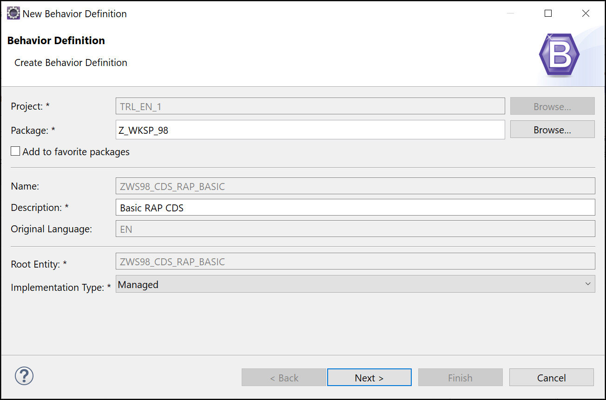
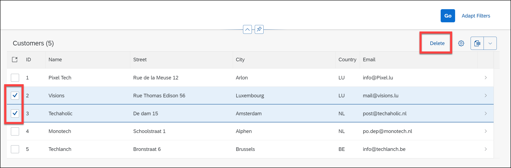
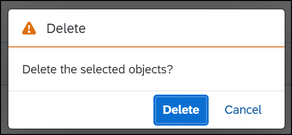
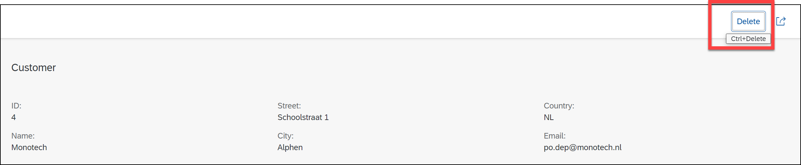
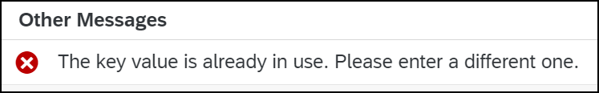
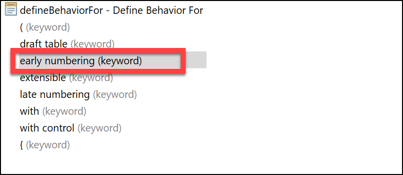

# RAP Basics add Delete, Update, Create

## Create a *Managed Behavior* for your CDS only for Delete

* Right click on your CDS and select **New Behavior Definition**
* 
* Set the *alias* to **Customer*
* Remove the **create** and **update** options:

``` ABAP
managed implementation in class zbp_ws##_cds_rap_basic unique;

define behavior for ZWS##_CDS_RAP_BASIC alias Customer
persistent table ZWS##_DT_CUST
lock master
authorization master ( instance )
//etag master <field_name>
{
  delete;
}
```

* Activate the Behavior
* Use **CTRL** + **SHIFT** + **1** to open the *Quick Assist* tab.
* Next click on the Class name in the Behavior and see the proposal in the *Quick Assist* tab.
* Double click the Proposal to generate the class

``` ABAP
CLASS zbp_ws##_cds_rap_basic DEFINITION PUBLIC ABSTRACT FINAL FOR BEHAVIOR OF zws##_cds_rap_basic.
ENDCLASS.

CLASS zbp_ws##_cds_rap_basic IMPLEMENTATION.
ENDCLASS.
```

``` ABAP
CLASS lhc_Customer DEFINITION INHERITING FROM cl_abap_behavior_handler.
  PRIVATE SECTION.

    METHODS get_instance_authorizations FOR INSTANCE AUTHORIZATION
      IMPORTING keys REQUEST requested_authorizations FOR Customer RESULT result.

ENDCLASS.

CLASS lhc_Customer IMPLEMENTATION.

  METHOD get_instance_authorizations.
  ENDMETHOD.

ENDCLASS.
```

* Test the delete function from either the preview from Eclipse or the BAS application.
* There is now a **Delete** button, when you select one or more lines you can delete them. Check out the difference between the V2 and V4 applications.
* Or click on a line and use the **Delete** button in the Object Page.

> If you have deleted all your records, just run the Class **ZWS##_INIT_DATA** again with F9.





## Add *Edit* Option to the Behavior Definition

* Add the **update** option to the Behavior Definition.

``` ABAP
managed implementation in class zbp_ws##_cds_rap_basic unique;

define behavior for ZWS##_CDS_RAP_BASIC alias Customer
persistent table ZWS##_DT_CUST
lock master
authorization master ( instance )
//etag master <field_name>
{
  update;
  delete;
}
```

* Activate the Behavior Definition.
* Test the application again. See the difference between the V2 and V4 versions.

> The V4 is not displaying the **Edit** Button whereas the V2 is. This is because for the V4 version we need to add the **Draft** option. We will do this later. For now just test with the V2 application.

* When you press the edit button you are able to change the *key* field **ID**. That is not wat we want.
* To prevent this we add **field (readonly) ID;** to the Behavior Definition. This will make the ID field read only.

``` ABAP

```

* Activate and the V2 application again.

## Add *Create* Option to the Behavior Definition

* Add the **create** option to the Behavior Definition.

``` ABAP
managed implementation in class zbp_ws##_cds_rap_basic unique;

define behavior for ZWS##_CDS_RAP_BASIC alias Customer
persistent table ZWS##_DT_CUST
lock master
authorization master ( instance )
etag master Lchg_Date_Time
{
  create;
  update;
  delete;

  field (readonly) ID;
}
```

* Activate the Behavior Definition.
* Test the application again.
* You now see that you can only *once* add a new record, because the second new record that you want to make gives you an error: 
* This can be solved by using **early numbering**

## Add **early numbering** to the Behavior Definition

* Add the **early numbering** to the Behavior Definition
* Use the Code Completion option **CTRL**+**SPACE** to display the options</br>
* Double click the word **create** to use the *Quick Assist* to generate a new method
* Implement the new method by checking the MAX number in the table and adding 1 to that max number.

``` ABAP
METHOD earlynumbering_create.

    LOOP AT entities INTO DATA(entity) WHERE id IS NOT INITIAL.
      APPEND CORRESPONDING #( entity ) TO mapped-customer.
    ENDLOOP.

    DATA(entities_without_id) = entities.
    DELETE entities_without_id WHERE id IS NOT INITIAL.

    "Get max travel ID from standard table
    SELECT SINGLE FROM zws##_dt_cust FIELDS MAX( id ) INTO @DATA(max_cust_id).

    "Set Customer Id
    LOOP AT entities_without_id INTO entity.
      max_cust_id += 1.
      entity-Id = max_cust_id.

      APPEND VALUE #( %cid = entity-%cid
                      %key = entity-%key
                    ) TO mapped-customer.
    ENDLOOP.

  ENDMETHOD.
```

* Activate the Behavior Definition.
* Test the application again.
* You now see that when you press save the record gets the next number in the table.
