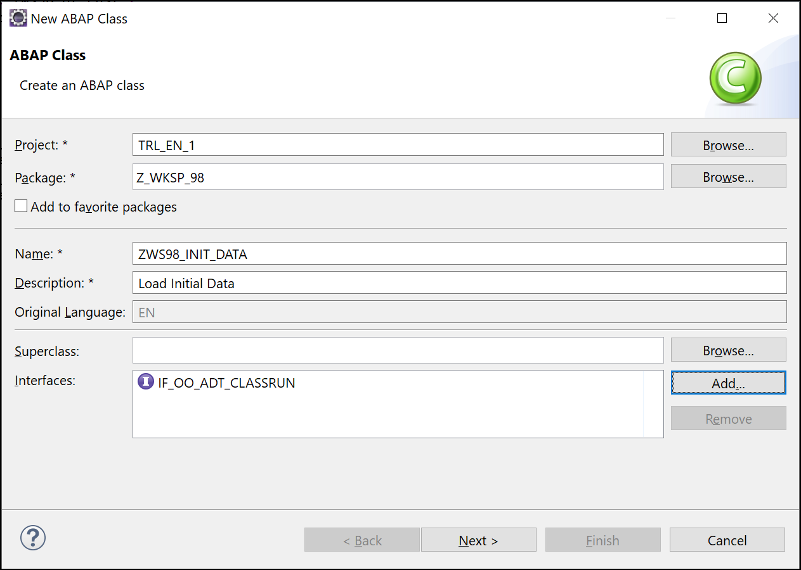

# RAP Basics

In this exercise we are going to create a RAP based Application.</br>

* We will create a table for Customers, build a Class to fill the table with some sample data, then create a Root View CDS for that table.
* Next we will create a Service Definition for that CDS, and create 2 Service Bindings. A V2 UI and a V4 UI Service Binding. This to show that there are sometimes a few differences between V2 and V4.
* Next we will create a two UI5 Fiori elements applications, one for each version V2 and V4.

Next we are going to add **delete**, **update** and **create** functionality to the application.

* We are going to add a **managed** *Behavior Definition* for the CDS.
* First the Delete
* Then the Edit
* Last the Create

## Create a table for Customers **ZWS##_DT_CUST**

```ABAP
@EndUserText.label : 'Customers'
@AbapCatalog.enhancement.category : #NOT_EXTENSIBLE
@AbapCatalog.tableCategory : #TRANSPARENT
@AbapCatalog.deliveryClass : #A
@AbapCatalog.dataMaintenance : #RESTRICTED
define table zws##_DT_CUST {
  key client     : abap.clnt not null;
  key id         : ztmde9_customer_id not null;
  name           : abap.char(30);
  street         : abap.char(50);
  city           : abap.char(50);
  country        : land1;
  email          : abap.char(249);
  crea_date_time : timestampl;
  crea_uname     : syuname;
  lchg_date_time : timestampl;
  lchg_uname     : syuname;

}
```

## Create a ABAP Class **ZWS##_INIT_DATA**

Create the ABAP Class and add the interface **IF_OO_ADT_CLASSRUN**, this will allow you to run the class from eclipse using the F9 function key.


```ABAP
CLASS zws##_init_data DEFINITION
  PUBLIC
  FINAL
  CREATE PUBLIC .

  PUBLIC SECTION.

    INTERFACES if_oo_adt_classrun .
    DATA: t_customers      TYPE STANDARD TABLE OF zws##_dt_cust.
    METHODS:
      delete_data,
      load_data.
  PROTECTED SECTION.
  PRIVATE SECTION.
ENDCLASS.


CLASS zws##_init_data IMPLEMENTATION.

  METHOD if_oo_adt_classrun~main.
    DATA: lv_reset  TYPE abap_boolean VALUE 'X',
          lv_delete TYPE abap_boolean VALUE ''.
    CASE abap_true.
      WHEN lv_reset.
        delete_data( ).
        load_data(  ).
        out->write( 'Data is reset!' ).
      WHEN lv_delete.
        delete_data( ).
        out->write( 'Data is deleted!' ).
    ENDCASE.
  ENDMETHOD.

  METHOD delete_data.
    DELETE FROM zws##_dt_cust WHERE id IS NOT NULL.
    COMMIT WORK AND WAIT.
  ENDMETHOD.

  METHOD load_data.
    DATA: lv_timestampl TYPE timestampl.
    GET TIME STAMP FIELD lv_timestampl.

    t_customers = VALUE #(
           ( id = '00001' name = 'Pixel Tech' street = 'Rue de la Meuse 12' city = 'Arlon' country = 'LU' email = 'info@Pixel.lu'
              crea_date_time = lv_timestampl crea_uname = sy-uname lchg_date_time = lv_timestampl lchg_uname = sy-uname )
           ( id = '00002' name = 'Visions' street = 'Rue Thomas Edison 56' city = 'Luxembourg' country = 'LU' email = 'mail@visions.lu'
              crea_date_time = lv_timestampl crea_uname = sy-uname lchg_date_time = lv_timestampl lchg_uname = sy-uname )
           ( id = '00003' name = 'Techaholic' street = 'De dam 15' city = 'Amsterdam' country = 'NL' email = 'post@techaholic.nl'
              crea_date_time = lv_timestampl crea_uname = sy-uname lchg_date_time = lv_timestampl lchg_uname = sy-uname )
           ( id = '00004' name = 'Monotech' street = 'Schoolstraat 1' city = 'Alphen' country = 'NL' email = 'po.dep@monotech.nl'
              crea_date_time = lv_timestampl crea_uname = sy-uname lchg_date_time = lv_timestampl lchg_uname = sy-uname )
           ( id = '00005' name = 'Techlanch' street = 'Bronstraat 6' city = 'Brussels' country = 'BE' email = 'info@techlanch.be'
              crea_date_time = lv_timestampl crea_uname = sy-uname lchg_date_time = lv_timestampl lchg_uname = sy-uname )
             ).
    MODIFY zws##_dt_cust FROM TABLE @t_customers.
    COMMIT WORK AND WAIT.
  ENDMETHOD.
  
ENDCLASS.
```

* Run the Class using F9, you will see the message *Data is reset!* in the Console of Eclipse.
* Check the content of the table by opening the table and then pressing F8 or right click on the table and select *Open With -> Data Preview*.

## Create a CDS **ZWS$$_CDS_RAP_BASIC**

* Create a CDS with Template **Define View**
* Add the word **root** between *define* and *view*

```ABAP CDS
define root view ...
```

* and add all the elements, but keep the names of the last 4 elements with the **_**.
* and set the @AccessControl.authorizationCheck to **#NOT_REQUIRED**.

```ABAP CDS
@AbapCatalog.sqlViewName: 'ZWS##CDSRAPB1'
@AbapCatalog.compiler.compareFilter: true
@AbapCatalog.preserveKey: true
@AccessControl.authorizationCheck: #NOT_REQUIRED
@EndUserText.label: 'Basic RAP CDS'
define root view ZWS##_CDS_RAP_BASIC
  as select from zws##_dt_cust
{
  key id             as Id,
      name           as Name,
      street         as Street,
      city           as City,
      country        as Country,
      email          as Email,
      crea_date_time as Crea_Date_Time,
      crea_uname     as Crea_Uname,
      lchg_date_time as Lchg_Date_Time,
      lchg_uname     as Lchg_Uname
}
```

## Add Basic Annotations for *lineitem* and *facet*

* Set *lineitem* & *identification* annotations for the fields Id, Name, Street, City, Country and Email.
* Add *@UI.facet*

```ABAP CDS
@AbapCatalog.sqlViewName: 'ZWS##CDSRAPB1'
@AbapCatalog.compiler.compareFilter: true
@AbapCatalog.preserveKey: true
@AccessControl.authorizationCheck: #NOT_REQUIRED
@EndUserText.label: 'Basic RAP CDS'
@UI.headerInfo.typeName: 'Customer'
@UI.headerInfo.typeNamePlural: 'Customers'
define root view ZWS##_CDS_RAP_BASIC
  as select from zws##_dt_cust
{
      @UI.facet: [{id: 'Customer', purpose: #STANDARD, type: #IDENTIFICATION_REFERENCE, label: 'Customer', position: 10 }]

      @UI: { lineItem: [{position: 10, importance: #HIGH, label: 'ID' }],
                 identification: [{position: 10, label: 'ID' }] }
  key id             as Id,
      @UI: { lineItem: [{position: 20, importance: #HIGH, label: 'Name' }],
                    identification: [{position: 20, label: 'Name' }] }
      name           as Name,
      @UI: { lineItem: [{position: 30, importance: #HIGH, label: 'Street' }],
            identification: [{position: 30, label: 'Street' }] }
      street         as Street,
      @UI: { lineItem: [{position: 40, importance: #HIGH, label: 'City' }],
           identification: [{position: 40, label: 'City' }] }
      city           as City,
      @UI: { lineItem: [{position: 50, importance: #HIGH, label: 'Country' }],
            identification: [{position: 50, label: 'Country' }] }
      country        as Country,
      @UI: { lineItem: [{position: 60, importance: #HIGH, label: 'Email' }],
            identification: [{position: 60, label: 'Email' }] }
      email          as Email,
      crea_date_time as Crea_Date_Time,
      crea_uname     as Crea_Uname,
      lchg_date_time as Lchg_Date_Time,
      lchg_uname     as Lchg_Uname
}
```

## Create Service Definition **ZUI_WKSP_##_RAP**

* Create a Service Definition and expose your CDS as *Customers*

```ABAP CDS
@EndUserText.label: 'Service definition Customers'
define service ZUI_WKSP_##_RAP {
    expose zws##_cds_rap_basic as Customers; 
}
```

## Create 2 Service Bindings **ZUI_WKSP_##_RAP_V2** and **ZUI_WKSP_##_RAP_V4**

* Create a Service Binding with *Binding Type* **ODAta V2 - UI** for *Service Definition* **ZUI_WKSP_##_RAP**</br>
* Activate and Publish the Service Binding.
* Test/Preview the Entity Set **Customers**</br></br>
* Create a Service Binding with *Binding Type* **ODAta V4 - UI** for *Service Definition* **ZUI_WKSP_##_RAP**</br>
* Activate and Publish the Service Binding.
* Test/Preview the Entity Set **Customers**</br></br>

## Create 2 Fiori Elements application with floorplan **List Report Object Page**, for the OData V2 and the OData V4

### V2

* Logon to your SAP Business Application Studio and create a *New Project From Template*
* Create a Fiori Appliction with *SAP Fiori Elements* and floorplan **List Report Object Page**
* Select *Connect to a System* and select your **abap-cloud-default_abap-trial-xxx (BTP)**
* Select your **V2** Service Binding
* Select *Customers* as your main entity
* Set Project Attributes:

| Name | Value |
| ------------ | ------------- |
| Module name | rap-basic-v2 |
| Application title | RAP Basic V2 |
| Application namespace | nato.workshop |
| Description | RAP Basic V2 |
| Project folder path | /home/user/projects |
| Minimum SAPUI5 version| leave as is |
| Add deployment configuration | Yes |
| Add FLP configuration | Yes |
| Configure advanced options| No |

* Set Deployment Configuration</br>
* Enter Fiori Launchpad Configuration

| Name | Value |
| ------------ | ------------- |
| Semantic Object | NATO |
| Action | RapBasicV2 |
| Title | RAP Basic V2 |
| Subtitle (optional) | Workshop |

* Run the Preview of the application

### V4

* Logon to your SAP Business Application Studio and create a *New Project From Template*
* Create a Fiori Appliction with *SAP Fiori Elements* and floorplan **List Report Object Page**
* Select *Connect to a System* and select your **abap-cloud-default_abap-trial-xxx (BTP)**
* Select your **V4** Service Binding
* Select *Customers* as your main entity
* Set Project Attributes:

| Name | Value |
| ------------ | ------------- |
| Module name | rap-basic-v4 |
| Application title | RAP Basic V4 |
| Application namespace | nato.workshop |
| Description | RAP Basic V4 |
| Project folder path | /home/user/projects |
| Minimum SAPUI5 version| leave as is |
| Add deployment configuration | Yes |
| Add FLP configuration | Yes |
| Configure advanced options| No |

* Set Deployment Configuration</br>
* Enter Fiori Launchpad Configuration

| Name | Value |
| ------------ | ------------- |
| Semantic Object | NATO |
| Action | RapBasicV4 |
| Title | RAP Basic V4 |
| Subtitle (optional) | Workshop |

* Run the Preview of the application

[Back to Exercises](../README.md)
