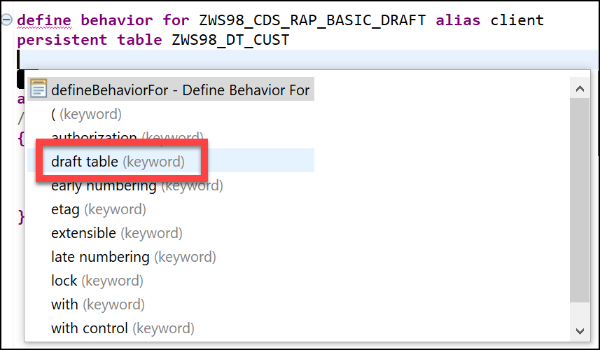

# RAP with Draft Verion

Now we are going to add *Draft version* to the process. To keep the basic version separated from the new Draft version we need to copy/create a new CDS.

* Copy CDS **ZWS##_CDS_RAP_BASIC** to **ZWS##_CDS_RAP_BASIC_DRAFT**
* Change the *sqlViewName*
* Change the words *Customer* to *Client*, that way we can see which CDS we are using when we test the applications.

```ABAP CDS
@AbapCatalog.sqlViewName: 'ZWS##CDSRAPB2'
@AbapCatalog.compiler.compareFilter: true
@AbapCatalog.preserveKey: true
@AccessControl.authorizationCheck: #NOT_REQUIRED
@EndUserText.label: 'Basic RAP CDS'
@UI.headerInfo.typeName: 'Client'
@UI.headerInfo.typeNamePlural: 'Clients'
define root view ZWS##_CDS_RAP_BASIC_DRAFT
  as select from zws##_dt_cust
{
      @UI.facet: [{id: 'Client', purpose: #STANDARD, type: #IDENTIFICATION_REFERENCE, label: 'Client', position: 10 }]

      @UI: { lineItem: [{position: 10, importance: #HIGH, label: 'ID' }],
                 identification: [{position: 10, label: 'ID' }] }
  key id             as Id,
      @UI: { lineItem: [{position: 20, importance: #HIGH, label: 'Name' }],
                    identification: [{position: 20, label: 'Name' }] }
      name           as Name,
      @UI: { lineItem: [{position: 30, importance: #HIGH, label: 'Street' }],
            identification: [{position: 30, label: 'Street' }] }
      street         as Street,
      @UI: { lineItem: [{position: 40, importance: #HIGH, label: 'City' }],
           identification: [{position: 40, label: 'City' }] }
      city           as City,
      @UI: { lineItem: [{position: 50, importance: #HIGH, label: 'Country' }],
            identification: [{position: 50, label: 'Country' }] }
      country        as Country,
      @UI: { lineItem: [{position: 60, importance: #HIGH, label: 'Email' }],
            identification: [{position: 60, label: 'Email' }] }
      email          as Email,
      crea_date_time as Crea_Date_Time,
      crea_uname     as Crea_Uname,
      lchg_date_time as Lchg_Date_Time,
      lchg_uname     as Lchg_Uname
}
```

* Add the new CDS to the Service Definition as *Clients*

```ABAP CDS
@EndUserText.label: 'Service definition Customers'
define service ZUI_WKSP_##_RAP {
  expose ZWS##_CDS_RAP_BASIC as Customers;
  expose ZWS##_CDS_RAP_BASIC_DRAFT as Clients;
}
```

* Add a new *managed* **Behavior Definition** to the new CDS
* Add the option **with draft;**
* Set the Alias to **client**
* Under *persistent table* add **draft table ZWS##_DT_CUST_DR**, use the Code Completion</br>
* Use the *Quick Assist* to generate the **Draft table** for you, See the newly added field **"%admin"**

```ABAP
@EndUserText.label : 'Draft table for entity ZWS##_CDS_RAP_BASIC_DRAFT'
@AbapCatalog.enhancement.category : #EXTENSIBLE_ANY
@AbapCatalog.tableCategory : #TRANSPARENT
@AbapCatalog.deliveryClass : #A
@AbapCatalog.dataMaintenance : #RESTRICTED
define table zws##_dt_cust_dr {
  key mandt      : mandt not null;
  key id         : ztmde9_customer_id not null;
  name           : abap.char(30);
  street         : abap.char(50);
  city           : abap.char(50);
  country        : land1;
  email          : abap.char(249);
  crea_date_time : timestampl;
  crea_uname     : syuname;
  lchg_date_time : timestampl;
  lchg_uname     : syuname;
  "%admin"       : include sych_bdl_draft_admin_inc;

}
```

* Add the options: **lock master total etag xx** and **etag master xx**
* Set the *field (readonly) id;*
* Result of the Behavior Definition should look like this.

```ABAP CDS
managed implementation in class zbp_ws##_cds_rap_basic_draft unique;
with draft;

define behavior for ZWS##_CDS_RAP_BASIC_DRAFT alias client
persistent table ZWS##_DT_CUST
draft table ZWS##_DT_CUST_DR
lock master total etag Lchg_Date_Time
authorization master ( instance )
etag master Lchg_Date_Time
{
  create;
  update;
  delete;

  field ( readonly ) id;
}
```

* Put your cursor on the class name in the first line of the Behavior Definition and use the *Quick Assist* to Create the implementation class.

* Test your application using the preview of **Clients** in the *Service Binding*
* Delete works as expected
* Edit, you now have the option to see the **Display Saved Version** or the **New Draft Version**
* If you make a change you shortly see **Saving Draft** at the bottom and then **Draft saved**. This tells you if there is a draft version available.
* With the *Cancel* button you get the option to *Discard* all changes.
* Create works again only 1 time, after that you get an error that the Key Value is already in use.

## Fix the Create

* To fix the option to create multiple draft versions you need to add the option **late numbering** to the Behavior Definition.

```ABAP CDS
managed implementation in class zbp_ws##_cds_rap_basic_draft unique;
with draft;
//strict; //Comment this line in to enable strict mode. The strict mode is prerequisite to be future proof regarding syntax and to be able to release your BO.

define behavior for ZWS##_CDS_RAP_BASIC_DRAFT alias client
late numbering
persistent table ZWS##_DT_CUST
draft table ZWS##_DT_CUST_DR
lock master total etag Lchg_Date_Time
authorization master ( instance )
etag master Lchg_Date_Time
{
  create;
  update;
  delete;

  field ( readonly ) id;
}
```

* When you activate the new Behavior Definition, you need to fix 2 things.
* First: use the *Quick Assist* to recreate the draft table, this because we need an extra key field.

```ABAP
@EndUserText.label : 'Draft table for entity ZWS98_CDS_RAP_BASIC_DRAFT'
@AbapCatalog.enhancement.category : #EXTENSIBLE_ANY
@AbapCatalog.tableCategory : #TRANSPARENT
@AbapCatalog.deliveryClass : #A
@AbapCatalog.dataMaintenance : #RESTRICTED
define table zws98_dt_cust_dr {
  key mandt      : mandt not null;
  key id         : ztmde9_customer_id not null;
  key draftuuid  : sdraft_uuid;
  name           : abap.char(30);
  street         : abap.char(50);
  city           : abap.char(50);
  country        : land1;
  email          : abap.char(249);
  crea_date_time : timestampl;
  crea_uname     : syuname;
  lchg_date_time : timestampl;
  lchg_uname     : syuname;
  "%admin"       : include sych_bdl_draft_admin_inc;

}
```

* To be able to generate the new definition of the Draft Table you first may have to delete the Draft Table or make sure there are no records in the Draft Table.

* Second: use the *Quick Assist* to add a new method for *late numbering*
* Implement the new method **adjust_numbers**, to get the latest number from the table

```ABAP
 METHOD adjust_numbers.
  IF mapped-client IS NOT INITIAL.
      "  Get max travel ID from standard table
      SELECT SINGLE FROM zws98_dt_cust FIELDS MAX( id ) INTO @DATA(max_cust_id).
      max_cust_id += 1.
      mapped-client[ 1 ]-%key-Id = max_cust_id.
    ENDIF.
  ENDMETHOD.
```

[Back to Exercises](../README.md)
